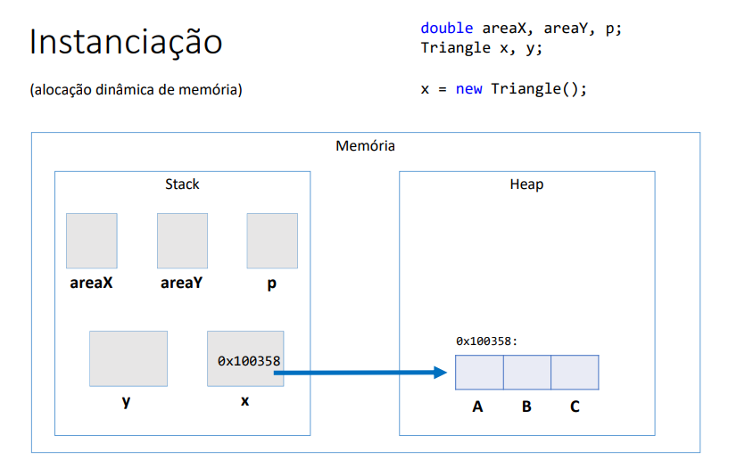
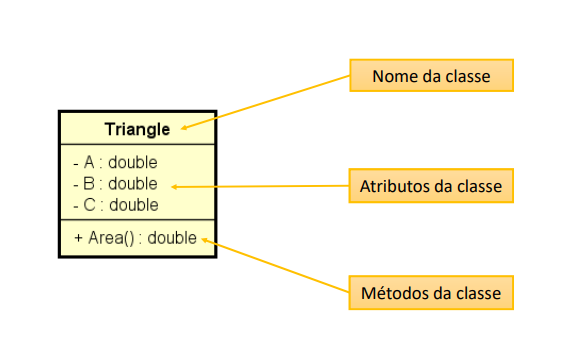
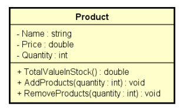

## Funções interessantes para String

- Formatar: toLowerCase(), toUpperCase(), trim()
- Recortar: substring(início), substring(inicio, fim)
- Substituir: Replace(char, char), Replace (string, string)
- Buscar a posição de uma parte de uma spring: IndexOf, LastIndexOf
- Recortar uma spring com base num separador: str.Split("")

## Funções escritas em Java

Funções: representam um processamento que possui um significado.
 - Math.sqrt(double)
 - System.out.println(string)
Principais vantagens : modularização, delegação e reaproveitamento

Dados de entrada e Saída:
Funções podem receber dados de entrada(parâmetros ou argumentos)
Funções podem ou não retornar uma saída

- Em orientação a objetos , funções em cçasses recebem o nome de "métodos".

## Classe

é um tipo estruturado que pode conter(membros)
- Atributos(dados/campos)
- métodos(funções/operações)

A classe também pode prover muitos outros recursos , tais como:
- Construtores
- Sobrecarga
- Encapsulamento
- Herança
- Polimorfismo

Exemplo:
- Entidade: Produto, cliente , Triangulo
- Serviço: ProdutoService, ClienteService, EmailService, storageService
- Controladores: ProdutoController, ClienteController
- Utilitarios: Calculadora, Compactador
- Outros(views, repositorios, gerenciadores, etc)

## Instanciação

Quando declaramos as variáveis conforme abaixo descrito abaixo , elas são criadas numa área da memória chamada stack,
é a área onde são criadas as variáveis estáticas( as variáveis que são declaradas no programa).

double areaX, areaY, p;
Triangle x,y;

Durante a execução do meu programa eu posso fazer uma alocação dinâmica de memmória usando o comando new.

x=new Triangle();

Vai ser instanciado/criado um objeto do tipo Triangle numa outra área de memória chamado Heap, essa área de memória Heap
é onde são criados os objetos dinâmicos durante a execução.

Verificando por exemplo a variavel x existe no stack, mas dentro dela não estão os dados do Triangulo e sim o endereço 
de memória, ou seja o endereço do Objeto que foi criado no Heap. 
Essa seta significa um ponteiro : a variavel x contém um endereço , que aponta para esse determinado lugar.

Classe: é a definição do tipo;

Objetos: são instancias da classe;

## Projeto da classe(UML)

Quais são os benefícios de se calcular a área de um triângulo por meio de um
MÉTODO dentro da CLASSE Triangle?
-  Reaproveitamento de código
- Delegação de responsabilidades

Discussao:

Toda classe em java é uma subclasse da classe Object.

Object possui os seguintes métodos:
- getClass: retorna o tipo do objeto;
- equals:compara se o objeto é igual ao outro
- hashcode: retorna um código hash do objeto;
- toString: converte o objeto para string;

## membros estáticos

Uma classe possui membros, que são atributos e métodos.

- Membros estáticos
Também chamados membros de classe em oposição a membros de instancia
São membros que fazem sentido independente de objetos. 
Não precisam de objetos para serem chamados . São chamados apartir do próprio nome da classe.

Aplicações comuns:
- classes utilitárias   -> Math.sqrt(double)
- Declarações de contantes

Uma classe que possui somente membros estáticos, pode ser uma classe estática tabém. Essa classe não poderá ser instanciada.

Nota1: o método main é um método estático, e eu não posso chamar outros métodos que não sejam estaticos dentro do main.
Nota2:Uma classe utilitária é essencialmente uma classe estática, sem atributos, sem encapsulação de estado e que contém 
apenas métodos estáticos. Este tipo de classe fornece funcionalidades comuns que são usadas nas aplicações.
Nota3: se os membros da minha classe não forem estáticos eu sou obrigada a instanciar o Objeto do tipo da classe, e tenho que chamar
as operações a partir do objeto.

