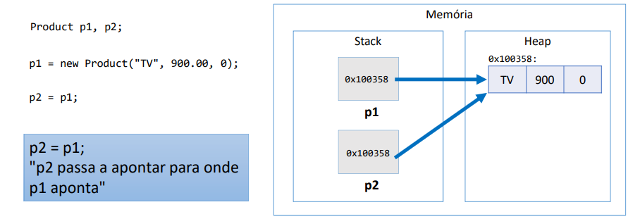
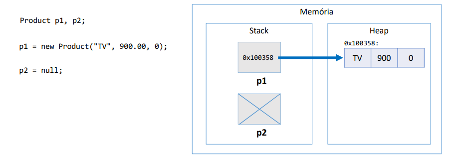
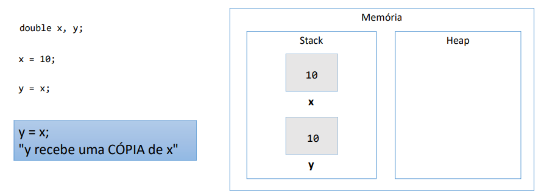
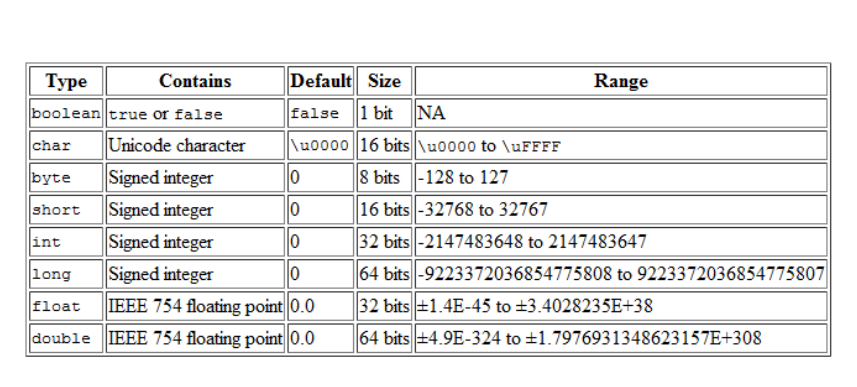
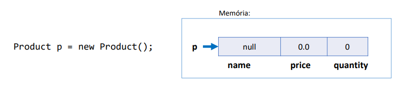
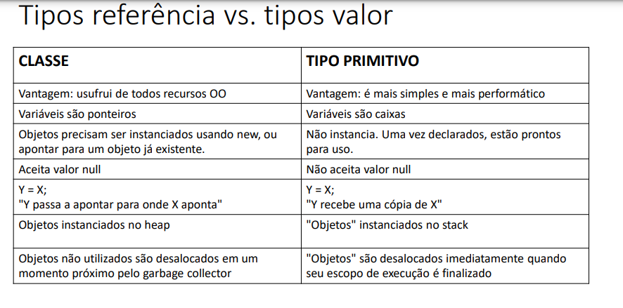
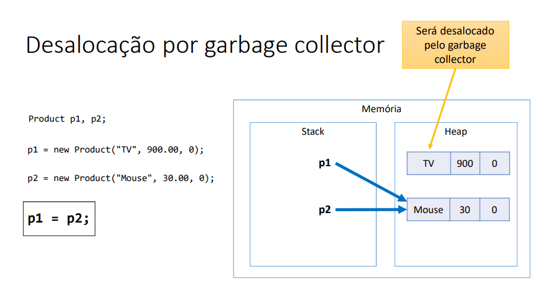

## Funções interessantes para String

- Formatar: toLowerCase(), toUpperCase(), trim()
- Recortar: substring(início), substring(inicio, fim)
- Substituir: Replace(char, char), Replace (string, string)
- Buscar a posição de uma parte de uma spring: IndexOf, LastIndexOf
- Recortar uma spring com base num separador: str.Split("")

## Funções escritas em Java

Funções: representam um processamento que possui um significado.
 - Math.sqrt(double)
 - System.out.println(string)
Principais vantagens : modularização, delegação e reaproveitamento

Dados de entrada e Saída:
Funções podem receber dados de entrada(parâmetros ou argumentos)
Funções podem ou não retornar uma saída

- Em orientação a objetos , funções em cçasses recebem o nome de "métodos".

## Classe

é um tipo estruturado que pode conter(membros)
- Atributos(dados/campos)
- métodos(funções/operações)

A classe também pode prover muitos outros recursos , tais como:
- Construtores
- Sobrecarga
- Encapsulamento
- Herança
- Polimorfismo

Exemplo:
- Entidade: Produto, cliente , Triangulo
- Serviço: ProdutoService, ClienteService, EmailService, storageService
- Controladores: ProdutoController, ClienteController
- Utilitarios: Calculadora, Compactador
- Outros(views, repositorios, gerenciadores, etc)

## Instanciação

Quando declaramos as variáveis conforme abaixo descrito abaixo , elas são criadas numa área da memória chamada stack,
é a área onde são criadas as variáveis estáticas( as variáveis que são declaradas no programa).

double areaX, areaY, p;
Triangle x,y;

Durante a execução do meu programa eu posso fazer uma alocação dinâmica de memmória usando o comando new.

x=new Triangle();

Vai ser instanciado/criado um objeto do tipo Triangle numa outra área de memória chamado Heap, essa área de memória Heap
é onde são criados os objetos dinâmicos durante a execução.

Verificando por exemplo a variavel x existe no stack, mas dentro dela não estão os dados do Triangulo e sim o endereço 
de memória, ou seja o endereço do Objeto que foi criado no Heap. 
Essa seta significa um ponteiro : a variavel x contém um endereço , que aponta para esse determinado lugar.

Classe: é a definição do tipo;

Objetos: são instancias da classe;

## Projeto da classe(UML)

Quais são os benefícios de se calcular a área de um triângulo por meio de um
MÉTODO dentro da CLASSE Triangle?
-  Reaproveitamento de código
- Delegação de responsabilidades

Discussao:

Toda classe em java é uma subclasse da classe Object.

Object possui os seguintes métodos:
- getClass: retorna o tipo do objeto;
- equals:compara se o objeto é igual ao outro
- hashcode: retorna um código hash do objeto;
- toString: converte o objeto para string;

## membros estáticos

Uma classe possui membros, que são atributos e métodos.

- Membros estáticos
Também chamados membros de classe em oposição a membros de instancia
São membros que fazem sentido independente de objetos. 
Não precisam de objetos para serem chamados . São chamados apartir do próprio nome da classe.

Aplicações comuns:
- classes utilitárias   -> Math.sqrt(double)
- Declarações de contantes

Uma classe que possui somente membros estáticos, pode ser uma classe estática tabém. Essa classe não poderá ser instanciada.

Nota1: o método main é um método estático, e eu não posso chamar outros métodos que não sejam estaticos dentro do main.
Nota2:Uma classe utilitária é essencialmente uma classe estática, sem atributos, sem encapsulação de estado e que contém 
apenas métodos estáticos. Este tipo de classe fornece funcionalidades comuns que são usadas nas aplicações.
Nota3: se os membros da minha classe não forem estáticos eu sou obrigada a instanciar o Objeto do tipo da classe, e tenho que chamar
as operações a partir do objeto.

## Construtores, palavras this, sobrecarga , encapsulamento

- Construtor

é uma operação especial da classe, que executa no momento da instanciação do objeto, quando nós damos o comando new.

Para que usar os construtores?

Uso comuns:
Inicia valores dos atributos 
Permitir ou obrigar que o objeto receba dados/dependencias no momento de sua instanciação(injeção de dependencia)

Se um construtor customizado não for especificado, a classe disponibiliza o construtor padrão:
Product p = new product();

é possivel especificar mais de um construtor na mesma classe (sobrecarga).

this: referencia para o atributo do próprio objeto. Ou seja ele serve para diferenciar o atributo do objeto do parametro do construtor.

Palavra this: é uma referencia oara o próprio objeto.

Usos comuns da palavra this:
- Diferenciar atributos de variáveis locais.
- Passar o próprio objeto como argumento na chamada de um método ou construtor

## Sobrecarga

• É um recurso que uma classe possui de oferecer mais de uma operação com o mesmo nome, porém com diferentes listas de
parâmetros

A sobrecarga de métodos (overload) é um conceito do polimorfismo que consiste basicamente em criar variações de um 
mesmo método, ou seja, a criação de dois ou mais métodos com nomes totalmente iguais em uma classe.

## Encapsulamento

• É um princípio que consiste em esconder detalhes de implementação de uma classe, expondo apenas
operações seguras e que mantenham os objetos em um estado consistente.
• Regra de ouro: o objeto deve sempre estar em um estado consistente, e a própria classe deve garantir isso.
- Um objeto NÃO deve expor nenhum atributo (usar modificador de acesso private)
  Os atributos devem ser acessados por meio de métodos get e set

## Modificadores de Acessso

• https://docs.oracle.com/javase/tutorial/java/javaOO/accesscontrol.html
• private: o membro só pode ser acessado na própria classe
• (nada): o membro só pode ser acessado nas classes do mesmo pacote
• protected: o membro só pode ser acessado no mesmo pacote, bem como em subclasses de pacotes diferentes
• public: o membro é acessado por todas classes (ao menos que ele resida em
um módulo diferente que não exporte o pacote onde ele está)

## Classes são tipos referencia

Classes são tipos referencia. Variáveis cujo tipo são classes não devem ser entendidas  como caixas, mas sim "tentáculos"(ponteiros) para caixas.

Stack: é a área da memória as variáveis que você declara no seu programa. Ex: Product p1,p2;

Quando eu faço p1 = new Product("TV", 900.00, 0);  passando os valores , vai ser alocado um objeto numa outra área de memória chamada heap

Heap: é a área da memória onde são alocados os objetos em tempo de execução, isso chama alocação dinâmica de memória

Essa variavel p1 não vai guardar o produto em si , as caixinhas do nome,valor, quantidade mas sim o endereço de memória
correspondente ao endereço de memória onde estiver o objeto que foi alocado.

Por isso dizemos que variáveis que são do tipo classe elas são na verdade referencias, tentáculos ou ponteiros, por que
dentro dela vai ter uma referencia, um endereço,  que vai dizer onde está o objeto. Inclusive nós  a identificamos
com uma seta.

## Valor null

Tipos referencia aceitam o valor "null", que indica que a variável aponta para ninguém.

quando eu digo que p2 recebe null , quer dizer que ela aponta para ninguém.

## Tipos primitivos são tipos valor

Em Java, tipos primitivos são tipos valor. Tipos valor são CAIXAS e não ponteiros. 

nesse caso eu guardo o próprio valor e não a referencia como no caso das classes referencia

## Valores Padrão

• Quando alocamos (new) qualquer tipo estruturado (classe ou array),
são atribuídos valores padrão aos seus elementos
• números: 0
• boolean: false
• char: caractere código 0
• objeto: null

## Desalocação de memória - garbage collector e escopo local

- Garbage collector

É um processo que automatiza o gerenciamento de memória de um programa em execução
• O garbage collector monitora os objetos alocados dinamicamente pelo programa (no heap), desalocando aqueles que não estão mais
sendo utilizados.

Um objeto sem referencia será desacolado pelo o garbage collector.

• Objetos alocados dinamicamente, quando não possuem mais
referência para eles, serão desalocados pelo garbage collector
• Variáveis locais são desalocadas imediatamente assim que seu escopo
local sai de execução

## Vetores

• Em programação, "vetor" é o nome dado a arranjos/array  unidimensionais

• Arranjo (array) é uma estrutura de dados:
      • Homogênea (dados do mesmo tipo)
      • Ordenada (elementos acessados por meio de posições)
      • Alocada de uma vez só, em um bloco contíguo de memória

• Vantagens:

    • Acesso imediato aos elementos pela sua posição
• Desvantagens:
  
    • Tamanho fixo
    • Dificuldade para se realizar inserções e deleções
