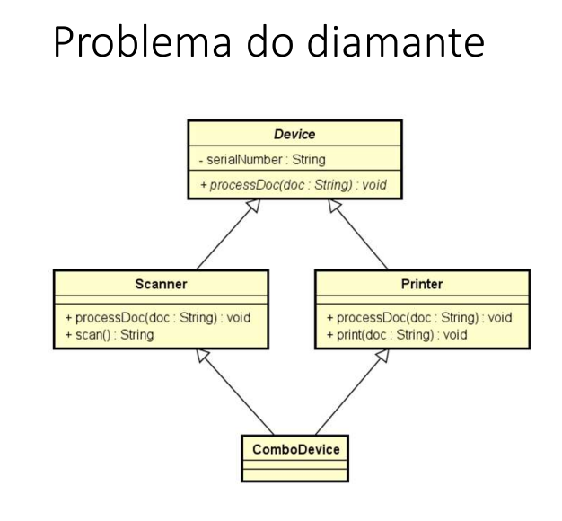

## Funções interessantes para String

- Formatar: toLowerCase(), toUpperCase(), trim()
- Recortar: substring(início), substring(inicio, fim)
- Substituir: Replace(char, char), Replace (string, string)
- Buscar a posição de uma parte de uma spring: IndexOf, LastIndexOf
- Recortar uma spring com base num separador: str.Split("")

## Funções escritas em Java

Funções: representam um processamento que possui um significado.
 - Math.sqrt(double)
 - System.out.println(string)
Principais vantagens : modularização, delegação e reaproveitamento

Dados de entrada e Saída:
Funções podem receber dados de entrada(parâmetros ou argumentos)
Funções podem ou não retornar uma saída

- Em orientação a objetos , funções em cçasses recebem o nome de "métodos".

## Classe

é um tipo estruturado que pode conter(membros)
- Atributos(dados/campos)
- métodos(funções/operações)

A classe também pode prover muitos outros recursos , tais como:
- Construtores
- Sobrecarga
- Encapsulamento
- Herança
- Polimorfismo

Exemplo:
- Entidade: Produto, cliente , Triangulo
- Serviço: ProdutoService, ClienteService, EmailService, storageService
- Controladores: ProdutoController, ClienteController
- Utilitarios: Calculadora, Compactador
- Outros(views, repositorios, gerenciadores, etc)

## Instanciação

Quando declaramos as variáveis conforme abaixo descrito abaixo , elas são criadas numa área da memória chamada stack,
é a área onde são criadas as variáveis estáticas( as variáveis que são declaradas no programa).

double areaX, areaY, p;
Triangle x,y;

Durante a execução do meu programa eu posso fazer uma alocação dinâmica de memmória usando o comando new.

x=new Triangle();

Vai ser instanciado/criado um objeto do tipo Triangle numa outra área de memória chamado Heap, essa área de memória Heap
é onde são criados os objetos dinâmicos durante a execução.

Verificando por exemplo a variavel x existe no stack, mas dentro dela não estão os dados do Triangulo e sim o endereço 
de memória, ou seja o endereço do Objeto que foi criado no Heap. 
Essa seta significa um ponteiro : a variavel x contém um endereço , que aponta para esse determinado lugar.

Classe: é a definição do tipo;

Objetos: são instancias da classe;

## Projeto da classe(UML)

Quais são os benefícios de se calcular a área de um triângulo por meio de um
MÉTODO dentro da CLASSE Triangle?
-  Reaproveitamento de código
- Delegação de responsabilidades

Discussao:

Toda classe em java é uma subclasse da classe Object.

Object possui os seguintes métodos:
- getClass: retorna o tipo do objeto;
- equals:compara se o objeto é igual ao outro
- hashcode: retorna um código hash do objeto;
- toString: converte o objeto para string;

## membros estáticos

Uma classe possui membros, que são atributos e métodos.

- Membros estáticos
Também chamados membros de classe em oposição a membros de instancia
São membros que fazem sentido independente de objetos. 
Não precisam de objetos para serem chamados . São chamados apartir do próprio nome da classe.

Aplicações comuns:
- classes utilitárias   -> Math.sqrt(double)
- Declarações de contantes

Uma classe que possui somente membros estáticos, pode ser uma classe estática tabém. Essa classe não poderá ser instanciada.

Nota1: o método main é um método estático, e eu não posso chamar outros métodos que não sejam estaticos dentro do main.
Nota2:Uma classe utilitária é essencialmente uma classe estática, sem atributos, sem encapsulação de estado e que contém 
apenas métodos estáticos. Este tipo de classe fornece funcionalidades comuns que são usadas nas aplicações.
Nota3: se os membros da minha classe não forem estáticos eu sou obrigada a instanciar o Objeto do tipo da classe, e tenho que chamar
as operações a partir do objeto.

## Construtores, palavras this, sobrecarga , encapsulamento

- Construtor

é uma operação especial da classe, que executa no momento da instanciação do objeto, quando nós damos o comando new.

Para que usar os construtores?

Uso comuns:
Inicia valores dos atributos 
Permitir ou obrigar que o objeto receba dados/dependencias no momento de sua instanciação(injeção de dependencia)

Se um construtor customizado não for especificado, a classe disponibiliza o construtor padrão:
Product p = new product();

é possivel especificar mais de um construtor na mesma classe (sobrecarga).

this: referencia para o atributo do próprio objeto. Ou seja ele serve para diferenciar o atributo do objeto do parametro do construtor.

Palavra this: é uma referencia oara o próprio objeto.

Usos comuns da palavra this:
- Diferenciar atributos de variáveis locais.
- Passar o próprio objeto como argumento na chamada de um método ou construtor

## Sobrecarga

• É um recurso que uma classe possui de oferecer mais de uma operação com o mesmo nome, porém com diferentes listas de
parâmetros

A sobrecarga de métodos (overload) é um conceito do polimorfismo que consiste basicamente em criar variações de um 
mesmo método, ou seja, a criação de dois ou mais métodos com nomes totalmente iguais em uma classe.

## Encapsulamento

• É um princípio que consiste em esconder detalhes de implementação de uma classe, expondo apenas
operações seguras e que mantenham os objetos em um estado consistente.
• Regra de ouro: o objeto deve sempre estar em um estado consistente, e a própria classe deve garantir isso.
- Um objeto NÃO deve expor nenhum atributo (usar modificador de acesso private)
  Os atributos devem ser acessados por meio de métodos get e set

## Modificadores de Acessso

• https://docs.oracle.com/javase/tutorial/java/javaOO/accesscontrol.html
• private: o membro só pode ser acessado na própria classe
• (nada): o membro só pode ser acessado nas classes do mesmo pacote
• protected: o membro só pode ser acessado no mesmo pacote, bem como em subclasses de pacotes diferentes
• public: o membro é acessado por todas classes (ao menos que ele resida em
um módulo diferente que não exporte o pacote onde ele está)

## Classes são tipos referencia

Classes são tipos referencia. Variáveis cujo tipo são classes não devem ser entendidas  como caixas, mas sim "tentáculos"(ponteiros) para caixas.

Stack: é a área da memória as variáveis que você declara no seu programa. Ex: Product p1,p2;

Quando eu faço p1 = new Product("TV", 900.00, 0);  passando os valores , vai ser alocado um objeto numa outra área de memória chamada heap

Heap: é a área da memória onde são alocados os objetos em tempo de execução, isso chama alocação dinâmica de memória

Essa variavel p1 não vai guardar o produto em si , as caixinhas do nome,valor, quantidade mas sim o endereço de memória
correspondente ao endereço de memória onde estiver o objeto que foi alocado.

Por isso dizemos que variáveis que são do tipo classe elas são na verdade referencias, tentáculos ou ponteiros, por que
dentro dela vai ter uma referencia, um endereço,  que vai dizer onde está o objeto. Inclusive nós  a identificamos
com uma seta.

## Valor null

Tipos referencia aceitam o valor "null", que indica que a variável aponta para ninguém.

quando eu digo que p2 recebe null , quer dizer que ela aponta para ninguém.

## Tipos primitivos são tipos valor

Em Java, tipos primitivos são tipos valor. Tipos valor são CAIXAS e não ponteiros. 

nesse caso eu guardo o próprio valor e não a referencia como no caso das classes referencia

## Valores Padrão

• Quando alocamos (new) qualquer tipo estruturado (classe ou array),
são atribuídos valores padrão aos seus elementos
• números: 0
• boolean: false
• char: caractere código 0
• objeto: null

## Desalocação de memória - garbage collector e escopo local

- Garbage collector

É um processo que automatiza o gerenciamento de memória de um programa em execução
• O garbage collector monitora os objetos alocados dinamicamente pelo programa (no heap), desalocando aqueles que não estão mais
sendo utilizados.

Um objeto sem referencia será desacolado pelo o garbage collector.

• Objetos alocados dinamicamente, quando não possuem mais
referência para eles, serão desalocados pelo garbage collector
• Variáveis locais são desalocadas imediatamente assim que seu escopo
local sai de execução

## Vetores

• Em programação, "vetor" é o nome dado a arranjos/array  unidimensionais

• Arranjo (array) é uma estrutura de dados:
      • Homogênea (dados do mesmo tipo)
      • Ordenada (elementos acessados por meio de posições)
      • Alocada de uma vez só, em um bloco contíguo de memória

• Vantagens:

    • Acesso imediato aos elementos pela sua posição
• Desvantagens:
  
    • Tamanho fixo
    • Dificuldade para se realizar inserções e deleções

## Boxing, unboxing e wrapper classes

- Boxing (encaixotamento): É o processo de conversão de um objeto tipo valor para um objeto tipo referência compatível;

int x = 20;
Object obj = x;
System.out.println(x);

lembrando que a mémoria de um tipo valor ficam na stack

- Unboxing(desencaixotamento): É o processo de conversão de um objeto tipo referência para um objeto tipo valor compatível;
int y = (int) obj;
System.out.println(y);

lembrando que a mémoria de um tipo Objeto ficam na heap

- Wrapper classes

  • São classes equivalentes aos tipos primitivos
  • Boxing e unboxing é natural na linguagem

  • Uso comum: campos de entidades em sistemas de informação (IMPORTANTE!)
           • Pois tipos referência (classes) aceitam valor null e usufruem dos recursos OO

## Laço "for each"

Sintaxe opcional e simplificada para percorrer coleções

Sintaxe:

for(Tipo apelido: coleção){
    <comando 1>
    <comando 2>
}

## Quais as diferenças entre array e arraylist?

- Array

Tem o tamanho fixo, temos que declarar o seu tamanho ao cria-ló

É uma estrutura de dados nativa do core do Java

Tem seus valores acessados por []

Pode armazenar tanto tipos primitivos como objetos

- Arraylist

Tem tamanho dinâmico, não é obrigatório declarar seu tamanho em sua instanciação

Faz parte do framework Collection, sendo uma implementação da interface List

Tem seus valores acessados por metodos, ex: get()

Não suporta tipos primitivos, apenas objetos

Obs: quando fazemos arraylist.add(1), o tipo primitivo int é convertido para um objeto Integer

## Listas - List

- Lista é uma estrutura de dados:
• Homogênea (dados do mesmo tipo)
• Ordenada (elementos acessados por meio de posições)
• Inicia vazia, e seus elementos são alocados sob demanda( diferente do vetor que já temos que declarar)
• Cada elemento ocupa um "nó" (ou nodo) da lista
• Lista encadeada por que cada nodo da lista aponta para o próximo nodo e assim por diante e o último nodo vai ter um valor nulo
ou indicador para falar que ele é o ultimo nodo da lista.

Uma interface é um tipo que define apenas a especificação das operações. Se um tipo é interface eu não posso instanciar esse 
tipo, por isso eu uso algumas classes para implentar a especificação.

-  Tipo (interface): List
   • Classes que implementam a interface: ArrayList, LinkedList, etc

• Vantagens:
    • listas tem Tamanho variável (diferente do vetor que tem tamanho fixo)
    • Facilidade para se realizar inserções e deleções
• Desvantagens:
    • Acesso sequencial aos elementos *

## Operações/comandos installments

• Tamanho da lista: size()
• Obter o elemento de uma posição: get(position)
• Inserir elemento na lista: add(obj), add(int, obj)
• Remover elementos da lista: remove(obj), remove(int), removeIf(Predicate)
• Encontrar posição de elemento: indexOf(obj), lastIndexOf(obj)
• Filtrar lista com base em predicado:
List<Integer> result = installments.stream().filter(x -> x > 4).collect(Collectors.toList());
• Encontrar primeira ocorrência com base em predicado:
Integer result = installments.stream().filter(x -> x > 4).findFirst().orElse(null);

## Observações List

- List não aceita tipos primitivos, só posso usar Object/  Wrappers Class;

## Matrizes

## Trabalhando com data-hora

Conceitos importantes

• Data-[hora] local:
ano-mês-dia-[hora] sem fuso horário
[hora] opcional 

• Data-hora global:
ano-mês-dia-hora com fuso horário

• Duração:
tempo decorrido entre duas data-horas

Quando usar?

• Data-[hora] local:
    Quando o momento exato não interessa a pessoas de outro fuso horário.
    Uso comum: sistemas de região única, Excel.
        Data de nascimento: "15/06/2001"
        Data-hora da venda: "13/08/2022 às 15:32" (presumindo não interessar fuso horário)

• Data-hora global:
    Quando o momento exato interessa a pessoas de outro fuso horário.
    Uso comum: sistemas multi-região, web.
        Quando será o sorteio? "21/08/2022 às 20h (horário de São Paulo)"
        Quando o comentário foi postado? "há 17 minutos"
        Quando foi realizada a venda? "13/08/2022 às 15:32 (horário de São Paulo)"
        Início e fim do evento? "21/08/2022 às 14h até 16h (horário de São Paulo)"

Timezone (fuso horário)

• GMT - Greenwich Mean Time
    • Horário de Londres
    • Horário do padrão UTC - Coordinated Universal Time
    • Também chamado de "Z" time, ou Zulu time

• Outros fuso horários são relativos ao GMT/UTC: • São Paulo: GMT-3
    • Manaus: GMT-4
    • Portugal: GMT+1

• Muitas linguagens/tecnologias usam nomes para as timezones: 
    • "US/Pacific"
    • "America/Sao_Paulo"
    • etc.

Esse padrão especifica como temos que representar datas e hora na forma de texto.

## Operações importantes com data-hora

## Data forma antes do java 8

Date era a forma mais classica de se armazenar uma data

## Enum e Composição

Enumerações

• É um tipo especial que serve para especificar de forma literal um conjunto de constantes relacionadas

• Palavra chave em Java: enum

• Vantagem: melhor semântica, código mais legível e auxiliado pelo compilador

• Referência: https://docs.oracle.com/javase/tutorial/java/javaOO/enum.html

 - Ciclo de vida de um pedido

Estado por quais um pedido passa ao longo do seu ciclo de vida

(Pagamento Pendente)->Cobrança-> (Processando) ->despacho  ->(enviando) ->entrega->(entregue)

## Notação UML para um tipo enumerado

Num sistema você pode ter classes que representam o desidn de um sistema: 

- views: telas do sistema
- controladores: é o que fez o meio de campo entre a tela e o sistema
- Entities: entidades de negócios como Produtos, Clientes, Pedidos
- Services: ondem temos a lógica/funcionalidades de um sistema
- Repositores: são Objetos responsáveis por acessar os dados de um banco de dados;

## Composição

• É um tipo de associação que permite que um objeto contenha outro

• Relação "tem-um" ou "tem-vários"

• Vantagens
• Organização: divisão de responsabilidades
• Coesão(cada objeto é responsável por uma unica coisa)
• Flexibilidade
• Reuso (podemos reaproveitar um objeto é mais de um lugar)

• Nota: embora o símbolo UML para composição (todo-parte) seja o diamante preto, neste contexto estamos chamando de composição qualquer associação
tipo "tem-um" e "tem-vários".

O simbolo de composição na UML é o diamante preto, sendo que a classe que estiver no diamante preto 
que é o pedido ele é o lado do todo  e o outro lado é o lado das partes.
Então estou dizendo que o pedido é o todo e ele contém as partes que são os itens. 

Isso aqui é uma associação de composição  que representa uma relação todo parte entre objetos.

A relação entre o pedido e o cliente , temos uma seta desenhada , não tem o diamante preto, por que
não é uma relação de todo parte, o cliente não é parte do pedido, mas está associado com o pedido
Mas mesmo assim chamamos uma composição de objetos. Na hora de você implementar  Pedido(Order)
vai ter um atributo Client.

O item de um pedido(Order item) tem um Produto, está associado com um produto.

Status do pedido que é o tipo do atributo que está em Order( - status: OrderStatus)

Lembrando que a composição de Objetos pode ocorrer não só com entidades, ela pode ocorrer com serviços

## Herança

• É um tipo de associação que permite que uma classe herde todos dados e comportamentos de outra

- Definições importantes:

 Vantagens:

    • Reuso
    • Polimorfismo

• Sintaxe

    • class A extends B

Herança permite o reuso de atributos e métodos (dados e comportamento)

## Definições importantes quando estamos trabalhando com Herança

Account é chamada de generaalização é o tipo mais genérico que eu tenho. Super Classe é Account

BussinessAccount é uma especialização é uma classe especifica. BussinessAccount é chamada de classe 
derivada. Falamos que a classe BussinessAcount estende Account, ou seja ela tem tudo que account tem
e mais algumas coisas.

Quando eu instancio um BussinesAccount eu vou ter um Objeto só, e um objeto vai ter todos os membros
das duas classes. Por isso falamos que herança é uma associação entre classes e não entre objetos.

## UpCasting e downcasting

upcasting: converte da subclasse para supreclasse.
downCasting: converte da superclasse para a subclasse

- Exemple

## Sobreposição, palavra super,anotação @Override

## Classes e métodos final

final quando usada em uma classe evita que ela seja herdada.
final quando usado no método evita que ele seja sopreposto

## Para quê utilizar a palavra final?

-  Segurança: dependendo das regras do negócio, às vezes é desejável garantir que uma classe não 
seja herdada, ou que um método não seja sobreposto.
  - Geralmente convém acrescentar final em métodos sobrepostos, pois sobreposições múltiplas  
  podem ser uma porta de entrada para inconsistências
- Performance: atributos de tipo de uma classe final são analisados de forma mais rápida em 
tempo de execução.
- Exemplo clássico: String

## Polimorfismo

Pilares POO

- Abstração(Abstraction.)
- Encapsulamento(Encapsulation.)
- Herança(Inheritance.)
- Polimorfismo(Polymorphism.)

- Polimorfismo

Em Programação Orientada a Objetos, polimorfismo é o recurso que
permite que variáveis de um mesmo tipo mais genérico possam
apontar para objetos de tipos específicos diferentes, tendo assim
comportamentos diferentes conforme cada tipo específico.

## Classes abstratas

• São classes que não podem ser instanciadas;

• É uma forma de garantir herança total: somente subclasses não
abstratas podem ser instanciadas, mas nunca a superclasse abstrata

- Questionamento

## Métodos abstratos

## Exceções

• Uma exceção é qualquer condição de erro ou comportamento  inesperado encontrado por um 
programa em execução

• Em Java, uma exceção é um objeto herdado da classe:
• java.lang.Exception - o compilador obriga a tratar ou propagar
• java.lang.RuntimeException - o compilador não obriga a tratar ou propagar

• Quando lançada, uma exceção é propagada na pilha de chamadas de
métodos em execução, até que seja capturada (tratada) ou o
programa seja encerrado

 Referencias: https://docs.oracle.com/javase/10/docs/api/java/lang/package-tree.html

Error: são erros que não se espera que o programador trate. ex: OutOfMemoryError(Estourou a memória)

Por que exceções?

O modelo de tratamento de exceções permite que erros sejam
tratados de forma consistente e flexível, usando boas práticas

• Vantagens de usar tratamento de exceções:

- Delega a lógica do erro para a classe responsável por conhecer as regras que
podem ocasionar o erro
-  Trata de forma organizada (inclusive hierárquica) exceções de tipos diferentes
-  A exceção pode carregar dados quaisquer

## Estrutura try-catch

• Bloco try ( tenta executar esso aqui)

    • Contém o código que representa a execução normal do trecho de código que
    pode acarretar em uma exceção

• Bloco catch (captura a exceção e executa uma lógica)
    
    • Contém o código a ser executado caso uma exceção ocorra
    • Deve ser especificado o tipo da exceção a ser tratada (upcasting é permitido,
    ou seja eu posso usar um tipo de exceção genérica que pega várias exceções ao mesmo
    tempo)
    Posso usar quantos blocos cats forem necessários

 ## Pilha de chamadas de métodos (stack trace)

O que é um StackTrace?

Um stacktrace é uma ferramenta de depuração muito útil. Ele mostra a pilha de chamadas 
(ou seja, a pilha de funções que foram chamadas até aquele ponto) no momento em que uma 
exceção não capturada foi lançada (ou no momento em que o rastreamento de pilha foi gerado
manualmente). Isso é muito útil porque não mostra apenas onde ocorreu o erro, mas também 
como o programa foi parar naquele local do código. Isso leva à próxima pergunta:

O que é uma exceção?

Uma exceção é o que o ambiente de tempo de execução usa para informar que ocorreu um erro. 
Exemplos populares são NullPointerException, IndexOutOfBoundsException ou ArithmeticException. 
Cada um deles é causado quando você tenta fazer algo que não é possível. Por exemplo, 
um NullPointerException será lançado quando você tentar desreferenciar um objeto Null.

    e.printStackTrace();  eu posso analisar a exceção

## Bloco Finally

É um bloco que contém código a ser executado independentemente de ter
ocorrido ou não uma exceção.

• Exemplo clássico: fechar um arquivo, conexão de banco de dados, ou outro
recurso específico ao final do processamento

## Criando exceções personalizadas

Geralmente quando uma classe é exceção eu colocamos o sufixo Exception.
A nossa exceção personalisada pode ser uma extensão da classe Exception ou uma extensão da classe RuntimeException 
A diferença das duas é que:
- RuntimeException é um tipo de exceção que o compilador não te obrigada a tratar a exceção, se você
não colocar o try/catch o compilador não sinaliza nada.
- Exception é um tipo de exceção que o compilador te obriga a tratar

- Clausula throws: propaga a exceção ao invéns de tratá-la
- Clausula throw: lança a exceção/"corta" o método
- Exception: compilador obrigada a atratar ou propagar
- Runctime Exception: compilador não obrigada

O modelo de tratamento de exceções permite que erros sejam tratados de forma consistente e flexivel ,
usando boas práticas.

- Vantagens
Lógica delegada
- Construtores podem ter tratamentos de exceçãoes
- Possibilidade de auxilio do compilador(Exception)
- Código mais simples , não há aninhamento de considionais : a qualquer momento que uma exceção for dispsrada ,  
a execução é interrompida e cai no bloco catch correspondente
- é possivel inclusive capturar outras exceções de sistema;

Nunca esquecer que a classe de négocio nunca pode dar print

## Trabalhando com arquivos

##  Lendo arquivo texto com classes File e Scanner
 
 Classes

  • File - Representação abstrata de um arquivo e seu caminho  - https://docs.oracle.com/javase/10/docs/api/java/io/File.html
  
  • Scanner - Leitor de texto - https://docs.oracle.com/javase/10/docs/api/java/util/Scanner.html
  
  • IOException (Exception) - https://docs.oracle.com/javase/10/docs/api/java/io/IOException.html

## FileReader e BufferedReader(ler arquivo)

Classes
• FileReader (stream de leitura de caracteres a partir de arquivos) - https://docs.oracle.com/javase/10/docs/api/java/io/FileReader.html
Stream em programação significa uma sequencia, em outras palavras quando eu instanciar um FileReader eu vou estabelecer uma sequencia de
leitura a partir de um aquivo, a medida que eu precisar ler esse arquivo eu vou navegando na Stream.

• BufferedReader (mais rápido)  - https://docs.oracle.com/javase/10/docs/api/java/io/BufferedReader.html - 
        https://stackoverflow.com/questions/9648811/specific-difference-betweenbufferedreader-and-filereader
O BufferedReader será instanciado a partir do FileReader e ele implementa algumas otimizações usando Buffer de memória

## Bloco try-with-resources

• É um bloco try que declara um ou mais recursos, e garante que esses recursos serão fechados ao final do bloco

• Disponível no Java 7 em diante

• https://docs.oracle.com/javase/tutorial/essential/exceptions/tryResourceClose.html

O bloco try-with-resources é muito melhor para se trabalhar com streams do que abrie e fechar e trabalhar manualmente essas streams
Não é necessário fazer o fechamento manual.

## FileWriter e BufferedWriter(Escrever)

Classes

• FileWriter (stream de escrita de caracteres em de arquivos) - https://docs.oracle.com/javase/10/docs/api/java/io/FileWriter.html
    
    • Cria/recria o arquivo: new FileWriter(path)
    • Acrescenta ao arquivo existente: new FileWriter(path, true)

• BufferedWriter (mais rápido)

    • https://docs.oracle.com/javase/10/docs/api/java/io/BufferedWriter.html

Do mesmo jeito que tínhamos o FileReader e BufferedReader para ler arquivos nós temos o FileWriter e BufferedWriter
para escrever 

## Interfaces(Definição Classica)

Interface é um tipo que define um conjunto de operações que uma classe deve implementar.
A interface estabelece um contrato que a classe deve cumprir.

Pra quê interfaces? Para criar sistemas com baixo acoplamento e flexíveis.

## Inversão de controle, Injeção de dependência

Quando fazemos associação direta de uma classe para outra gera um acoplamento forte, Por que a classe conhece a 
dependencia concreta. Se a classe concreta mudar a classe terá que alterar a classe em alguns pontos de alteração.

Quando a classe depende da interface nós temos um acoplamento fraco,pois a classe não conhece a dependencia concreta.
Se a classe concreta mudar , a claase que a utiliza não muda nada.

Se a propria classe fica responsável por instanciar as suas dependencias você gera um forte acoplamento e gera dois 
pontos de alteração.

- Inversão de controle
  Padrão de desenvolvimento que consiste em retirar da classe a responsabilidade de instanciar suas dependências.
- Injeção de dependência
uma forma de realizar a inversão de controle: um componente externoinstancia a dependência, que é então injetada no 
objeto "pai". 
Pode serimplementada de várias formas: 

    Construtor 
    Classe de instanciação (builder / factory) 
    Container / framework( que faz o processo automaticamente)

## Herdar vs. cumprir contrato

Em ambos os casos tanto na implementação da interface quanto na classe abstrata com 2 subclasses herndando nós temos:

• Relação é-um (vale para interface e herança)

• Generalização/especialização(vale para interface e herança)

• Polimorfismo(vale para interface e herança)

- Diferença fundamental entre herança e interface:

• Herança => reuso de informações e comportamentos

• Interface => contrato a ser cumprido

## Herança múltipla e o problema do diamante

A herança múltipla pode gerar o problema do diamante: uma ambiguidade causada pela existência do mesmo método em mais de 
uma superclasse.
Herança múltipla não é permitida na maioria das linguagens!

## Porém, uma classe pode implementar mais de uma interface

ATENÇÃO:
Isso NÃO é herança múltipla,pois NÃO HÁ REUSO na relação entre ComboDevice e asinterfaces Scanner e Printer.
ComboDevice não herda, mas sim implementa as interfaces(cumpre o contrato)

A linguagem java não permite extender mais de uma classe. Para esse tipo de implementação usamos uma interface

## Interface Comparable

Interface Comparable — Como comparar objetos na linguagem de programação Java

A comparação de dados é uma tarefa essencial em algoritmo de ordenação. Apenas dessa forma é possível identificar quais
dados são os menores, maiores e iguais. A comparação de dados funciona de maneira diferente para tipos primitivos e 
objetos na linguagem Java.

Tipos primitivos
Os tipos primitivos são facilmente comparados. Para este fim, existem operadores de igualdade e relacionais nativos da linguagem. São eles:

== igual que
!= diferente que
> maior que
>= maior igual que
< menor que
<= menor igual que

int a = 10;        
int b = 13;        
if(a < b){            
System.out.println("a é menor que b");         
}else{            
System.out.println("a é menor que b");        
}

- Igualdade de objetos

Os objetos são tipos de dados complexos que podem ser compostos por vários atributos. Devido a esta característica, 
é preciso implementar um  método específico para verificar a igualdade de todos os atributos. Na linguagem Java, este 
é papel do método equals.

String s = "Uma String";        
String t = "Outra String";        
if(s.equals(t)){            
System.out.println("As duas Strings são iguais.");        
}else{            
System.out.println("As duas Strings são diferentes.");        
}

O método equals é definido na classe Object e verifica apenas se o hashcode dos objetos são iguais. 
Por isso esse método deve ser implementado em todas as classes que deseja testar a igualdade.

- Como verificar qual é o objeto maior

A classe Object não fornece um método padrão para comparação relacionais de objetos. Para este objetivo é preciso
utilizar a interface Comparable.java.

O primeiro passo é implementar a interface na classe desejada.

public class Produto implements Comparable<Produto> { }

O segundo passo é adicionar o método compareTo na classe.

@Override
public int compareTo(Produto o) {
return 0;
}

O método retorna um inteiro. O retorno tem os seguintes significados:

Um inteiro negativo: o objeto é menor que
Zero: Os objetos comparados são iguais
Um inteiro positivo: o objeto é maior que
O terceiro passo é implementar o método compareTo.

OBS: formato csv é separado por vírgula

## Default methods( defender methods) métodos padrão

• A partir do Java 8, interfaces podem conter métodos concretos.

As interfaces podem ter métodos estaticos e privados

• A intenção básica é prover implementação padrão para métodos, de modo a evitar:

• 1) repetição de implementação em toda classe que implemente a interface

• 2) a necessidade de se criar classes abstratas para prover reuso da implementação 

os métodos padrão vem com a palavrinha default e assim o compilador não reclama.

• Outras vantagens:

• Manter a retrocompatibilidade com sistemas existentes

• Permitir que "interfaces funcionais" (que devem conter apenas um método)possam prover outras operações padrão reutilizáveis

Considerações importantes:

• Sim: agora as interfaces podem prover reuso

• Sim: agora temos uma forma de herança múltipla

• Mas o compilador reclama se houver mais de um método com a mesma
assinatura, obrigando a sobrescreve-lo

• Interfaces ainda são bem diferentes de classes abstratas. Interfaces
não possuem recursos tais como construtores e atributos.

get/set seria importante para fazer encapsulamento ou seja validação

## Collections em java

Uma coleção (collection) é uma estrutura de dados que serve para agrupar muitos elementos em uma única unidade, estes 
elementos precisão ser Objetos, pode ter coleções homogêneas e heterogêneas, normalmente utilizamos coleções heterogêneas
de um tipo especifico.

A interface Iterable representa uma coleção de Objetos que podem ser iterados

A interface Collection é a interface principal que tem a assinatura dos métodos para adicionar e remover elementos e manipular
esses dados também.

LinkedList listas encadeadas.

Todas as interfaces e classes são encontradas dentro do pacote (package) java.util, embora a interface Map não ser filha 
direta da interface Collection ela também é considerada uma coleção devido a sua função.

- Alguns dos métodos que devem ser implementados por todas as subclasses de Collection:

add(Object e) – Adiciona um Objeto dentro da coleção.
addAll(Collection c) – Adiciona uma coleção de Objetos dentro da coleção.
contains(Object o) – Verifica se um Objeto está dentro da coleção.
clear() - Remove todos os Objetos da coleção.

isEmpty() - Retorna um boolean informando se a coleção está vazia ou não.
remove(Object o) – Remove um Objeto da coleção.
size() - Retorna o tamanho da coleção.
toArray() - Converte uma coleção em um vetor.

## Java List

A interface List faz parte da Api de Collections. A list representa uma lista ordenada de Objetos, é por meio da ordem que 
a lista pode ser iterada em uma determinada ordem, e significa que cada objeto pode ser acessado em uma determinada posição
na lista.

O List é uma interface e o ArrayList é a classe que a implementa.

Uma interface list representa uma coleção ordenada de elementos
- Ordered
- Not Unique
Exemplo : 3,3,5,6,5,3

## Java Set

A Interface Set representa uma coleção não ordenada  de elementos unicos.
Set é a interface e o HashSet é sua implementação.

- Unordered
- Unique
Exemplo:
- 24,3,89

- Características - Set

Velocidade na pesquisa de dados, sendo mais rápida que um objeto do tipo List;
A inserção de dados é mais lenta;
Permite trabalhar com conjuntos e pode ser implementado como instâncias das classes HashSet ou TreeSet;
Não precisa especificar a posição para adicionar um elemento;
Não aceita valores duplicados. Se caso inserir um registro que já tenha no Set não será adicionado.
Podem ser implementados como instâncias das classes HashSet ou TreeSet;

Read more: http://www.linhadecodigo.com.br/artigo/3669/trabalhando-com-a-interface-set-no-java.aspx#ixzz7jOGYzAIN

## Como Set testa igualdade?

Como as coleções Hash testam igualdade?

• Se hashCode e equals estiverem implementados:
    
    • Primeiro hashCode. Se der igual, usa equals para confirmar.
    
    • Lembre-se: String, Integer, Double, etc. já possuem equals e hashCode

• Se hashCode e equals NÃO estiverem implementados:

    • Compara as referências (ponteiros) dos objetos.

## Como TreeSet compara os elementos?

Recordando as implementações

Set possui tres implementações Principais:

-  Principais implementações:

          HashSet - mais rápido (operações O(1) em tabela hash) e não ordenado
          TreeSet - mais lento (operações O(log(n)) em árvore rubro-negra) e ordenado pelo compareTo do objeto (ou Comparator)
          LinkedHashSet - velocidade intermediária e elementos na ordem em que são adicionados

Ele utiliza o CompareTo para comparar elementos, temos que implementar a classe Comparable<>

- Classe HashSet

Classe que faz parte do pacote “java.util” e que é uma implementação da interface Set onde utiliza uma tabela hash, por isso do nome da classe.

Características do HashSet
Não tem ordenação na varredura ou impressão. A ordem de saída não é a mesma de entrada;
Aceitam valores do tipo null;
Não é sincronizada (thread-safe);
Velocidade no acesso, leitura e modificação de dados;

Read more: http://www.linhadecodigo.com.br/artigo/3669/trabalhando-com-a-interface-set-no-java.aspx#ixzz7jOGkuVYN

- Classe TreeSet

Essa classe fornece objetos de coleção de ordenação natural e faz parte da implementação da interface Set e está localizada dentro do pacote “java.util”.

Características
Os elementos inseridos dentro desse tipo de conjunto devem implementar a interface Comparable;
A ordenação é por elementos únicos;
Não suporta objetos nulos, se caso um elemento ser nulo é lançado a exceção NullPointerException;

Read more: http://www.linhadecodigo.com.br/artigo/3669/trabalhando-com-a-interface-set-no-java.aspx#ixzz7jOGtp0VF

## Map

Map é como se fosse um dicionarios, que guarda chave e valor.  -> Map<K,V>

• https://docs.oracle.com/javase/10/docs/api/java/util/Map.html

• É uma coleção de pares chave / valor

        • Não admite repetições do objeto chave
        • Os elementos são indexados pelo objeto chave (não possuem posição)
        • Acesso, inserção e remoção de elementos são rápidos

• Uso comum: cookies, local storage, qualquer modelo chave-valor

• Principais implementações:

    • HashMap - mais rápido (operações O(1) em tabela hash) e não ordenado
    • TreeMap - mais lento (operações O(log(n)) em árvore rubro-negra) e ordenado pelo compareTo do objeto (ou Comparator)
    • LinkedHashMap - velocidade intermediária e elementos na ordem em que são adicionados

Alguns métodos importantes

• put(key, value)-> insere elemento, remove(key), containsKey(key), get(key) -> recupera o elemenro pela chave

    • Comparação é Baseado em equals e hashCode
    • Se equals e hashCode não existir, é usada comparação de ponteiros

• clear() -> limpar o conjunto

• size()

• keySet() - retorna um Set<K>

• values() - retornaa um Collection<V> do tipo valor

## Generics

• Generics permitem que classes, interfaces e métodos possam ser parametrizados por tipo. 

Seus benefícios são:

• Reuso
• Type safety
• Performance

• Uso comum: coleções

## Tipos curinga (wildcard types)

Generics são invariantes
List<Object> não é o supertipo de qualquer tipo de lista:

List<Object> myObjs = new ArrayList<Object>();
List<Integer> myNumbers = new ArrayList<Integer>();
myObjs = myNumbers; // erro de compilação

O ponto de interrogação (?) é conhecido como curinga na programação genérica. Representa um tipo desconhecido. 
O curinga pode ser usado em várias situações, como o tipo de um parâmetro, campo ou variável local; às vezes como um 
tipo de retorno. Ao contrário dos arrays, diferentes instanciações de um tipo genérico não são compatíveis entre si, 
nem mesmo explicitamente. Essa incompatibilidade pode ser atenuada pelo curinga se ? é usado como um parâmetro de tipo 
real.

Para declarar um curinga de limite superior, use o caractere curinga ('?'), seguido pela palavra-chave extends, seguida 
por seu limite superior.

public static void add(List<? extends Number> list)

O supertipo de qualquer tipo de lista é List<?>. Este é um tipo curinga:
List<?> myObjs = new ArrayList<Object>();
List<Integer> myNumbers = new ArrayList<Integer>();
myObjs = myNumbers;

Com tipos curinga podemos fazer métodos que recebem um genérico de "qualquer tipo"

Não é possível adicionar dados a uma coleção de tipo curinga. O compilador já informa. Isso ocorre por que O compilador 
não sabe qual é o tipo específico do qual a lista foi instanciada.

## Curingas delimitados (bounded wildcards)

- Problema 2 (princípio get/put)
  Vamos fazer um método que copia os elementos de uma lista para uma
  outra lista que pode ser mais genérica que a primeira.
  List<Integer> myInts = Arrays.asList(1, 2, 3, 4);
  List<Double> myDoubles = Arrays.asList(3.14, 6.28);
  List<Object> myObjs = new ArrayList<Object>();
  copy(myInts, myObjs);
  copy(myDoubles, myObjs);

## hashCode e equals

• São operações da classe Object utilizadas para comparar se um objeto é igual a outro

• equals: lento, resposta 100%

• hashCode: rápido, porém resposta positiva não é 100%

• Tipos comuns (String, Date, Integer, Double, etc.) já possuem implementação para essas operações. Classes personalizadas
precisam sobrepô-las.

- Equals
  Método que compara se o objeto é igual a outro, retornando true ou false.

  String a = "Maria";
  String b = "Alex";
  System.out.println(a.equals(b));

- HashCode

Método que retorna um número inteiro representando um código gerado a partir das informações do objeto

String a = "Maria";
String b = "Alex";
System.out.println(a.hashCode());
System.out.println(b.hashCode());

- Regra de ouro do HashCode

• Se o hashCode de dois objetos for diferente, então os dois objetos são diferentes

• Se o código de dois objetos for igual, muito provavelmente os objetos são iguais (pode haver colisão)

HashCode e Equals personalizados
public class Client {
private String name;
private String email;
}

- Set<T> é uma interface

• Representa um conjunto de elementos (similar ao da Álgebra)
        • Não admite repetições
        • Elementos não possuem posição, poed possuir ordem
        • Acesso, inserção e remoção de elementos são rápidos
        • Oferece operações eficientes de conjunto: interseção, união, diferença.
        • Principais implementações:
                • HashSet - mais rápido (operações O(1) em tabela hash) e não ordenado
                • TreeSet - mais lento (operações O(log(n)) em árvore rubro-negra) e ordenado pelo
                compareTo do objeto (ou Comparator)
                • LinkedHashSet - velocidade intermediária e elementos na ordem em que são adicionados

Alguns métodos importantes

• add(obj), remove(obj), contains(obj)

• Baseado em equals e hashCode

• Se equals e hashCode não existir, é usada comparação de ponteiros

• clear()
• size()
• removeIf(predicate)

• addAll(other) - união: adiciona no conjunto os elementos do outro conjunto, sem repetição
• retainAll(other) - interseção: remove do conjunto os elementos não contitos em other
• removeAll(other) - diferença: remove do conjunto os elementos contidos em other

## Programação Funcional e Expressões Lambda

- Comparator

Uma interface comparator é usada para ordenar os objetos de classes definidas pelo usuário. 
Um objeto comparator é capaz de comparar dois objetos da mesma classe .
A ordem de classificação é decidida pelo valor de retorno do método compareTo()
O método retorna um número que indica se o objeto que está sendo comparado é menor, 
igual ou maior que o objeto que está sendo passado como argumento.

• Podemos implementar a comparação de produtos por meio da
implementação da interface Comparable<Product>

• Entretanto, desta forma nossa classe não fica fechada para
alteração: se o critério de comparação mudar, precisaremos
alterar a classe Product.

• Podemos então usar o default method "sort" da interface List:
default void sort(Comparator<? super E> c)

- Transparencia Referencial

Uma função possui transparência referencial se seu resultado for sempre o mesmo
para os mesmos dados de entrada. Benefícios: simplicidade e previsibilidade.
Transparencial Referencial é quando o resultado da função depende exclusivamente dos valores de entrada
aí você vai ter os meus resultados para os valores de entrada.

- Objetos imutáeis : na programação imperativa eu posso alterar um vetor, eu posso alterar o tamanho de uma variável. já
na programação funcional é comum que os objetos sejam imutáveis. Qual a vantagem de se ter um Objeto imutável?
O programa fica mais simples, aquela variável vale um valor e eu sei que ela não vai mudar, então fica mais simples de 
entender e dar manutenção no programa. Além disso objetos imutáveis são thread Safe ou seja mais fácil de se trabalhar com 
concorrencia.

- Funções são objetos de primeira Ordem/Classe: Isso significa que funções podem, por exemplo, serem passadas como parâmetros de
  métodos, bem como retornadas como resultado de métodos. Isso é muito comum em programação funcional

- Expressividade/Código conciso: ou seja diferente da imperativa que é verboso e ocupa muito espaço.Na programação funcional 
o código é conciso

## O que são "expressões lambda"?

Em programação funcional, expressão lambda corresponde a uma função anônima, ou seja uma função que não foi declarada
e ela é de de primeira classe. Ela pode ser passada como argumento para outras funções.

Cálculo Lambda = formalismo matemático base da programação funcional

Expressão lambda = função anônima de primeira classe

## Interface Funcional

É uma interface que possui um único método abstrato. Suas implementações serão tratadas como expressões lambda

Na linguagem java a interface funcional tem um mapeamento direto com a expressão lambda. No fundo a expressão lambda
será tratada como uma interface funcional, ela só possui um método abstrato. 

Exemplos de Interface funcional em java:

- Predicate
- Function
- Consumer( Nota: ao contrário das outras interfaces funcionais, no caso do Consumer, é esperado ele possa gerar 
efeitos colaterais, por que o método abstrata da interface Consumer é um método void,ele simplismente faz uma ação
e essa ação pode ser qualquer coisa, é mais esperado que ela cause efeito colateral, mas é ua exceção )

No fundo quando mexemos com uma expressão lambda estamos mexendo com uma interface funcional.

## Predicate - interface Funcional

Predicate é uma interface parametrizada com o tipo T, e ela possui apenas um método abstrato chamado test.

## Consumer - interface Funcional

Consumer é uma interface parametrizada com o tipo T, e ela possui apenas um método abstrato chamado accept.

## Function - interface Funcional

Function é uma interface que possui dois parametros , um tipo T e um tipo R E possui um método apply que recebe um 
objeto do tipo T e retorna um Objeto do tipo R. Ou seja é um Função que recebe um T e retorna um R.

Nota sobre a função map

• A função "map" (não confunda com a estrutura de dados Map) é uma
função que aplica uma função a todos elementos de uma stream.

- Stream é uma sequencia de dados; 
- A função map não funciona a partir de uma lista, ela funciona a partir de uma stream. 
Então teremos que converter a nossa lista para stream, aplicar o map e depois converter a stream de volta para lista.

• Conversões:

        • List para stream: .stream()
        • Stream para List: .collect(Collectors.toList())

## Recordado

- removeIf(Predicate): função removeIf que recebe um Predicate como argumento, Predicate é uma função que recebe um objeto
e retorna true ou false.
- foreach(Consumer): o foreach que recebe uma função especial chamada Consumer
- map(Function) :map recebe uma função do tipo Function 

Mas se eu quiser criar uma função, que recebe outra função como argumento?

## Stream

É uma sequencia de elementos advinda de uma fonte de dados que oferece suporte a "operações agregadas".
• Fonte de dados: coleção, array, função de iteração, recurso de E/S

- https://www.oracle.com/br/technical-resources/articles/java-stream-api.html

a Streams API, novo recurso do Java que facilita o desenvolvimento, reduz o tamanho do código e simplifica o uso do paralelismo
Uma das novas features recebe o nome de Expressões Lambda (EL)
Outro recurso adicionado à nova versão da linguagem é a API para lidar com datas, a Date and Time, baseada na famosa 
biblioteca JodaTime. O novo pacote, java.time, possui várias classes para trabalhar com objetos que armazenam apenas 
datas, horas ou mesmo ambos de forma simultânea.

Essa versão trouxe também o recurso denominado Default Methods, que foi introduzido para possibilitar a evolução de 
interfaces ao permitir que interfaces já existentes ofereçam métodos novos sem que os códigos que as implementem também 
tenham que fornecer uma implementação para esses métodos. Diante disso, note que um dos focos dessa nova versão continua 
sendo manter a compatibilidade com códigos legados e ser o menos intrusivo possível, ou seja, afetar o menos possível 
as antigas APIs. Essa nova feature foi usada para incluir o método stream() na API de Collections, por exemplo, e 
possibilitar que todas as coleções sejam fontes de dados para streams. Além deste, outros métodos padrão também foram 
incorporados à API de coleções, como o removeIf() na interface Collection, e em Comparator, o método reversed(), que 
retorna um novo comparador que realiza a ordenação ao contrário.

A Streams API traz uma nova opção para a manipulação de coleções em Java seguindo os princípios da programação funcional. 
Combinada com as expressões lambda, ela proporciona uma forma diferente de lidar com conjuntos de elementos, oferecendo 
ao desenvolvedor uma maneira simples e concisa de escrever código que resulta em facilidade de manutenção e paralelização 
sem efeitos indesejados em tempo de execução.

A proposta em torno da Streams API é fazer com que o desenvolvedor não se preocupe mais com a forma de se programar o 
comportamento, deixando a parte relacionada ao controle de fluxo e loop a cargo da API. É algo muito parecido com o 
que é feito com Threads, onde os aspectos mais complexos ficam encapsulados em APIs e as regras de negócio passam a ser a 
única responsabilidade do desenvolvedor.

Outro ponto a se destacar sobre a Streams API diz respeito à eficiência do processamento. Com o aperfeiçoamento constante 
do hardware, sobretudo a proliferação das CPUs multicore, a API levou isso em consideração e com o apoio do paradigma 
funcional, suporta a paralelização de operações para processar os dados – abstraindo a lógica de baixo nível para se 
ter um código multithreading – e deixa o desenvolvedor concentrar-se totalmente nas regras existentes.

## Características Stream

• Sequência de elementos: Uma stream provê uma interface para um conjunto sequencial de valores de um determinado tipo. 
Contudo, streams não armazenam elementos. Eles são processados sob demanda;

• Fonte de dados: Streams consomem dados de uma fonte, como coleções, arrays ou mesmo recursos de E/S (entrada e saída);

• Stream é uma solução para processar sequências de dados de forma:

• Declarativa (iteração interna: escondida do programador)
       
        • Parallel-friendly (imutável -> thread safe)
        • Sem efeitos colaterais
        • Sob demanda (lazy evaluation)

• Operações de agregação: Streams suportam operações comuns a linguagens de programação funcionais, como filtrar, 
modificar, transformar o elemento em outro e assim por diante. Essas operações podem ser realizadas em série ou em paralelo.
Além disso, as operações relacionadas a streams têm duas características fundamentais que as tornam muito diferentes das 
operações sobre coleções. São elas:

Acesso sequencial (não há índices)

Single-use: só pode ser "usada" uma vez

Pipeline: operações em streams retornam novas streams. Então é possível criar uma cadeia de operações (fluxo de processamento).

Saiba que as operações intermediárias sempre retornam uma nova stream, de modo que seja possível realizar o encadeamento de 
múltiplas operações intermediárias. Já as operações terminais, como o próprio nome sugere, residem no final da cadeia de 
operações e seu objetivo é fechar o processo. Elas retornam um resultado diferente de uma stream, que pode ser um valor 
ou um objeto. Em suma, a Streams API trabalha convertendo uma fonte de dados em uma Stream. Em seguida, realiza o 
processamento dos dados através das operações intermediárias e, por fim, retorna uma nova coleção ou valor 
reduzido (map-reduce) com a chamada a uma operação terminal.

- Operações intermediárias e terminais

• O pipeline é composto por zero ou mais operações intermediárias e uma terminal.

• Operação intermediária:

        • Produz uma nova streams (encadeamento)
        • Só executa quando uma operação terminal é invocada (lazy evaluation)

• Operação terminal:

        • Produz um objeto não-stream (coleção ou outro)
        • Determina o fim do processamento da stream

- Operações intermediárias

• filter
• map
• flatmap
• peek
• distinct
• sorted
• skip
• limit (*)
* short-circuit(por que corta a execução)

Algumas das operações intermediárias mais utilizadas são: filter(), map(), sorted(), limit() e distinct().

- Filter O método filter() é usado para filtrar elementos de uma stream de acordo com uma condição (predicado). 
Para isso, ele recebe como parâmetro um objeto que implementa a interface Predicate<T> (interface funcional que
define uma função com valor de retorno igual a um boolean) e retorna uma nova stream contendo apenas os elementos
que satisfazem à condição.

- Map : Diante de algumas situações se faz necessário realizar transformações em uma lista de dados. O método map() 
permite realizar essas mudanças sem a necessidade de variáveis intermediárias, apenas utilizando como argumento uma 
função do tipo java.util.function.Function, que, assim como Predicate<T>, também é uma interface funcional. 
Essa função toma cada elemento de uma stream como parâmetro e retorna o elemento processado como resposta. 
O resultado será uma nova stream contendo os elementos mapeados a partir da stream original.

- Sorted: A ordenação de elementos em coleções é uma tarefa recorrente no dia a dia de todo desenvolvedor. No Java 8, 
felizmente, isso foi bastante facilitado, eliminando a necessidade de implementar o verboso Comparator, assim como as 
classes internas anônimas, proporcionando ao código clareza e simplicidade. Para isso, a Streams API oferece a operação 
sorted(). Esse método retorna uma nova stream contendo os elementos da stream original ordenados de acordo com algum 
critério.

- Operações terminais

• forEach
• forEachOrdered
• toArray
• reduce
• collect
• min
• max
• count
• anyMatch (*)
• allMatch (*)
• noneMatch (*)
• findFirst (*)
• findAny (*)
* short-circuit (quando a condição é satisfeita o elemento encerra o processamento )

- Criar uma stream

Como criar streams O primeiro passo para se trabalhar com streams é saber como criá-las A forma mais comum é através de 
uma coleção de dados, tendo em vista que o principal propósito dessa API é tornar mais flexível e eficiente o 
processamento de coleções.

• Basta chamar o método stream() ou parallelStream() a partir de qualquer objeto Collection.

-> https://docs.oracle.com/javase/10/docs/api/java/util/Collection.html

• Outras formas de se criar uma stream incluem:

    • Stream.of
    • Stream.ofNullable
    • Stream.iterate

## Acesso a banco de dados com JDBC

-  JDBC (Java Database Connectivity): API padrão do Java para acesso a dados

Criando a aplicação java -> o jdbc permite você programar o acesso a dados de uma forma única.
e na sua aplicação você vai instalar um driver do JDBC . O JDBC Driver Manager vai converter o código único (Java application)
para os BD específicos, no exemplo da figura Postgres, Oracle...) e cada um desses Drivers vai converter o código
que fiz (java application) usando a API do JDBC para o código nativo para acessar o BD específico.

- Operações básicas da álgebra Relacional

   - Restrição
   - Projeção
   - Produto Cartesiano
   - Junção (produto cartesiano + restrição de chaves correspondentes)

Operação produto cartesiano -> SELECT * FROM PRODUCT, CATEGORY

Operação junção:

    SELECT *
    FROM PRODUCT, CATEGORY
    WHERE
        PRODUCT.CATEGORY_ID = CATEGORY.ID

    SELECT *
    FROM PRODUCT 
    INNER JOIN CATEGORY cat
        ON PRODUCT.CATEGORY_ID = cat.ID

Operação de Restrição:

    SELECT *
    FROM PRODUCT 
    INNER JOIN CATEGORY cat ON PRODUCT.CATEGORY_ID = cat.ID
    WHERE CATEGORY.NAME = 'Computers'

A clausura Where é o que faz a restrição.

Operação de Projeção

    SELECT PRODUCT.*, CATEGORY.NAME
    FROM PRODUCT 
    INNER JOIN CATEGORY cat ON PRODUCT.CATEGORY_ID = cat.ID
    WHERE CATEGORY.NAME = 'Computers'

## Referencias

- https://youtu.be/d3QbptJRln4?list=PLL8woMHwr36HmQfxqqqxns5GexTNmxFqK
- 