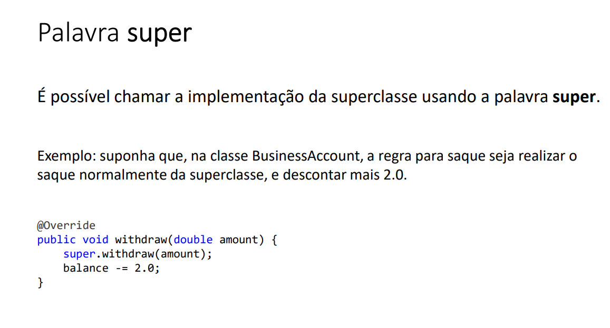
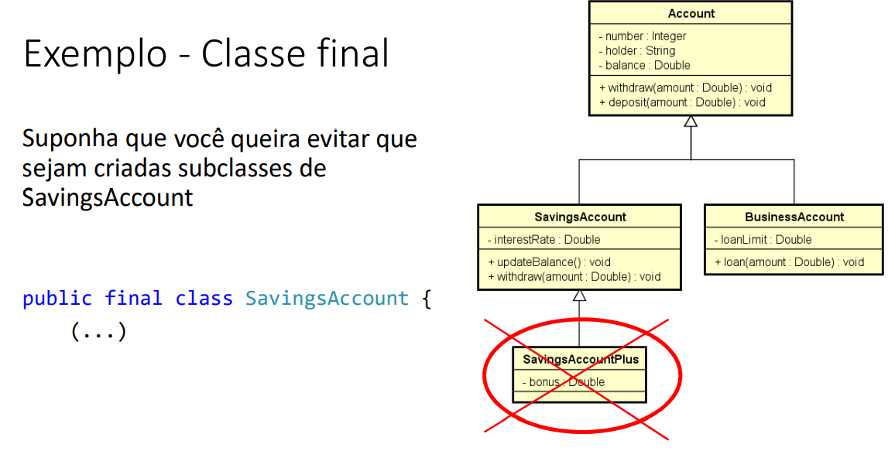

## Funções interessantes para String

- Formatar: toLowerCase(), toUpperCase(), trim()
- Recortar: substring(início), substring(inicio, fim)
- Substituir: Replace(char, char), Replace (string, string)
- Buscar a posição de uma parte de uma spring: IndexOf, LastIndexOf
- Recortar uma spring com base num separador: str.Split("")

## Funções escritas em Java

Funções: representam um processamento que possui um significado.
 - Math.sqrt(double)
 - System.out.println(string)
Principais vantagens : modularização, delegação e reaproveitamento

Dados de entrada e Saída:
Funções podem receber dados de entrada(parâmetros ou argumentos)
Funções podem ou não retornar uma saída

- Em orientação a objetos , funções em cçasses recebem o nome de "métodos".

## Classe

é um tipo estruturado que pode conter(membros)
- Atributos(dados/campos)
- métodos(funções/operações)

A classe também pode prover muitos outros recursos , tais como:
- Construtores
- Sobrecarga
- Encapsulamento
- Herança
- Polimorfismo

Exemplo:
- Entidade: Produto, cliente , Triangulo
- Serviço: ProdutoService, ClienteService, EmailService, storageService
- Controladores: ProdutoController, ClienteController
- Utilitarios: Calculadora, Compactador
- Outros(views, repositorios, gerenciadores, etc)

## Instanciação

Quando declaramos as variáveis conforme abaixo descrito abaixo , elas são criadas numa área da memória chamada stack,
é a área onde são criadas as variáveis estáticas( as variáveis que são declaradas no programa).

double areaX, areaY, p;
Triangle x,y;

Durante a execução do meu programa eu posso fazer uma alocação dinâmica de memmória usando o comando new.

x=new Triangle();

Vai ser instanciado/criado um objeto do tipo Triangle numa outra área de memória chamado Heap, essa área de memória Heap
é onde são criados os objetos dinâmicos durante a execução.

Verificando por exemplo a variavel x existe no stack, mas dentro dela não estão os dados do Triangulo e sim o endereço 
de memória, ou seja o endereço do Objeto que foi criado no Heap. 
Essa seta significa um ponteiro : a variavel x contém um endereço , que aponta para esse determinado lugar.

Classe: é a definição do tipo;

Objetos: são instancias da classe;

## Projeto da classe(UML)

Quais são os benefícios de se calcular a área de um triângulo por meio de um
MÉTODO dentro da CLASSE Triangle?
-  Reaproveitamento de código
- Delegação de responsabilidades

Discussao:

Toda classe em java é uma subclasse da classe Object.

Object possui os seguintes métodos:
- getClass: retorna o tipo do objeto;
- equals:compara se o objeto é igual ao outro
- hashcode: retorna um código hash do objeto;
- toString: converte o objeto para string;

## membros estáticos

Uma classe possui membros, que são atributos e métodos.

- Membros estáticos
Também chamados membros de classe em oposição a membros de instancia
São membros que fazem sentido independente de objetos. 
Não precisam de objetos para serem chamados . São chamados apartir do próprio nome da classe.

Aplicações comuns:
- classes utilitárias   -> Math.sqrt(double)
- Declarações de contantes

Uma classe que possui somente membros estáticos, pode ser uma classe estática tabém. Essa classe não poderá ser instanciada.

Nota1: o método main é um método estático, e eu não posso chamar outros métodos que não sejam estaticos dentro do main.
Nota2:Uma classe utilitária é essencialmente uma classe estática, sem atributos, sem encapsulação de estado e que contém 
apenas métodos estáticos. Este tipo de classe fornece funcionalidades comuns que são usadas nas aplicações.
Nota3: se os membros da minha classe não forem estáticos eu sou obrigada a instanciar o Objeto do tipo da classe, e tenho que chamar
as operações a partir do objeto.

## Construtores, palavras this, sobrecarga , encapsulamento

- Construtor

é uma operação especial da classe, que executa no momento da instanciação do objeto, quando nós damos o comando new.

Para que usar os construtores?

Uso comuns:
Inicia valores dos atributos 
Permitir ou obrigar que o objeto receba dados/dependencias no momento de sua instanciação(injeção de dependencia)

Se um construtor customizado não for especificado, a classe disponibiliza o construtor padrão:
Product p = new product();

é possivel especificar mais de um construtor na mesma classe (sobrecarga).

this: referencia para o atributo do próprio objeto. Ou seja ele serve para diferenciar o atributo do objeto do parametro do construtor.

Palavra this: é uma referencia oara o próprio objeto.

Usos comuns da palavra this:
- Diferenciar atributos de variáveis locais.
- Passar o próprio objeto como argumento na chamada de um método ou construtor

## Sobrecarga

• É um recurso que uma classe possui de oferecer mais de uma operação com o mesmo nome, porém com diferentes listas de
parâmetros

A sobrecarga de métodos (overload) é um conceito do polimorfismo que consiste basicamente em criar variações de um 
mesmo método, ou seja, a criação de dois ou mais métodos com nomes totalmente iguais em uma classe.

## Encapsulamento

• É um princípio que consiste em esconder detalhes de implementação de uma classe, expondo apenas
operações seguras e que mantenham os objetos em um estado consistente.
• Regra de ouro: o objeto deve sempre estar em um estado consistente, e a própria classe deve garantir isso.
- Um objeto NÃO deve expor nenhum atributo (usar modificador de acesso private)
  Os atributos devem ser acessados por meio de métodos get e set

## Modificadores de Acessso

• https://docs.oracle.com/javase/tutorial/java/javaOO/accesscontrol.html
• private: o membro só pode ser acessado na própria classe
• (nada): o membro só pode ser acessado nas classes do mesmo pacote
• protected: o membro só pode ser acessado no mesmo pacote, bem como em subclasses de pacotes diferentes
• public: o membro é acessado por todas classes (ao menos que ele resida em
um módulo diferente que não exporte o pacote onde ele está)

## Classes são tipos referencia

Classes são tipos referencia. Variáveis cujo tipo são classes não devem ser entendidas  como caixas, mas sim "tentáculos"(ponteiros) para caixas.

Stack: é a área da memória as variáveis que você declara no seu programa. Ex: Product p1,p2;

Quando eu faço p1 = new Product("TV", 900.00, 0);  passando os valores , vai ser alocado um objeto numa outra área de memória chamada heap

Heap: é a área da memória onde são alocados os objetos em tempo de execução, isso chama alocação dinâmica de memória

Essa variavel p1 não vai guardar o produto em si , as caixinhas do nome,valor, quantidade mas sim o endereço de memória
correspondente ao endereço de memória onde estiver o objeto que foi alocado.

Por isso dizemos que variáveis que são do tipo classe elas são na verdade referencias, tentáculos ou ponteiros, por que
dentro dela vai ter uma referencia, um endereço,  que vai dizer onde está o objeto. Inclusive nós  a identificamos
com uma seta.

## Valor null

Tipos referencia aceitam o valor "null", que indica que a variável aponta para ninguém.

quando eu digo que p2 recebe null , quer dizer que ela aponta para ninguém.

## Tipos primitivos são tipos valor

Em Java, tipos primitivos são tipos valor. Tipos valor são CAIXAS e não ponteiros. 

nesse caso eu guardo o próprio valor e não a referencia como no caso das classes referencia

## Valores Padrão

• Quando alocamos (new) qualquer tipo estruturado (classe ou array),
são atribuídos valores padrão aos seus elementos
• números: 0
• boolean: false
• char: caractere código 0
• objeto: null

## Desalocação de memória - garbage collector e escopo local

- Garbage collector

É um processo que automatiza o gerenciamento de memória de um programa em execução
• O garbage collector monitora os objetos alocados dinamicamente pelo programa (no heap), desalocando aqueles que não estão mais
sendo utilizados.

Um objeto sem referencia será desacolado pelo o garbage collector.

• Objetos alocados dinamicamente, quando não possuem mais
referência para eles, serão desalocados pelo garbage collector
• Variáveis locais são desalocadas imediatamente assim que seu escopo
local sai de execução

## Vetores

• Em programação, "vetor" é o nome dado a arranjos/array  unidimensionais

• Arranjo (array) é uma estrutura de dados:
      • Homogênea (dados do mesmo tipo)
      • Ordenada (elementos acessados por meio de posições)
      • Alocada de uma vez só, em um bloco contíguo de memória

• Vantagens:

    • Acesso imediato aos elementos pela sua posição
• Desvantagens:
  
    • Tamanho fixo
    • Dificuldade para se realizar inserções e deleções

## Boxing, unboxing e wrapper classes

- Boxing (encaixotamento): É o processo de conversão de um objeto tipo valor para um objeto tipo referência compatível;

int x = 20;
Object obj = x;
System.out.println(x);

lembrando que a mémoria de um tipo valor ficam na stack

- Unboxing(desencaixotamento): É o processo de conversão de um objeto tipo referência para um objeto tipo valor compatível;
int y = (int) obj;
System.out.println(y);

lembrando que a mémoria de um tipo Objeto ficam na heap

- Wrapper classes

  • São classes equivalentes aos tipos primitivos
  • Boxing e unboxing é natural na linguagem

  • Uso comum: campos de entidades em sistemas de informação (IMPORTANTE!)
           • Pois tipos referência (classes) aceitam valor null e usufruem dos recursos OO

## Laço "for each"

Sintaxe opcional e simplificada para percorrer coleções

Sintaxe:

for(Tipo apelido: coleção){
    <comando 1>
    <comando 2>
}

## Quais as diferenças entre array e arraylist?

- Array

Tem o tamanho fixo, temos que declarar o seu tamanho ao cria-ló

É uma estrutura de dados nativa do core do Java

Tem seus valores acessados por []

Pode armazenar tanto tipos primitivos como objetos

- Arraylist

Tem tamanho dinâmico, não é obrigatório declarar seu tamanho em sua instanciação

Faz parte do framework Collection, sendo uma implementação da interface List

Tem seus valores acessados por metodos, ex: get()

Não suporta tipos primitivos, apenas objetos

Obs: quando fazemos arraylist.add(1), o tipo primitivo int é convertido para um objeto Integer

## Listas

- Lista é uma estrutura de dados:
• Homogênea (dados do mesmo tipo)
• Ordenada (elementos acessados por meio de posições)
• Inicia vazia, e seus elementos são alocados sob demanda( diferente do vetor que já temos que declarar)
• Cada elemento ocupa um "nó" (ou nodo) da lista
• Lista encadeada por que cada nodo da lista aponta para o próximo nodo e assim por diante e o último nodo vai ter um valor nulo
ou indicador para falar que ele é o ultimo nodo da lista.

Uma interface é um tipo que define apenas a especificação das operações. Se um tipo é interface eu não posso instanciar esse 
tipo, por isso eu uso algumas classes para implentar a especificação.

-  Tipo (interface): List
   • Classes que implementam a interface: ArrayList, LinkedList, etc

• Vantagens:
    • listas tem Tamanho variável (diferente do vetor que tem tamanho fixo)
    • Facilidade para se realizar inserções e deleções
• Desvantagens:
    • Acesso sequencial aos elementos *

## Operações/comandos list

• Tamanho da lista: size()
• Obter o elemento de uma posição: get(position)
• Inserir elemento na lista: add(obj), add(int, obj)
• Remover elementos da lista: remove(obj), remove(int), removeIf(Predicate)
• Encontrar posição de elemento: indexOf(obj), lastIndexOf(obj)
• Filtrar lista com base em predicado:
List<Integer> result = list.stream().filter(x -> x > 4).collect(Collectors.toList());
• Encontrar primeira ocorrência com base em predicado:
Integer result = list.stream().filter(x -> x > 4).findFirst().orElse(null);

## Observações List

- List não aceita tipos primitivos, só posso usar Object/  Wrappers Class;

## Matrizes

## Trabalhando com data-hora

Conceitos importantes

• Data-[hora] local:
ano-mês-dia-[hora] sem fuso horário
[hora] opcional 

• Data-hora global:
ano-mês-dia-hora com fuso horário

• Duração:
tempo decorrido entre duas data-horas

Quando usar?

• Data-[hora] local:
    Quando o momento exato não interessa a pessoas de outro fuso horário.
    Uso comum: sistemas de região única, Excel.
        Data de nascimento: "15/06/2001"
        Data-hora da venda: "13/08/2022 às 15:32" (presumindo não interessar fuso horário)

• Data-hora global:
    Quando o momento exato interessa a pessoas de outro fuso horário.
    Uso comum: sistemas multi-região, web.
        Quando será o sorteio? "21/08/2022 às 20h (horário de São Paulo)"
        Quando o comentário foi postado? "há 17 minutos"
        Quando foi realizada a venda? "13/08/2022 às 15:32 (horário de São Paulo)"
        Início e fim do evento? "21/08/2022 às 14h até 16h (horário de São Paulo)"

Timezone (fuso horário)

• GMT - Greenwich Mean Time
    • Horário de Londres
    • Horário do padrão UTC - Coordinated Universal Time
    • Também chamado de "Z" time, ou Zulu time

• Outros fuso horários são relativos ao GMT/UTC: • São Paulo: GMT-3
    • Manaus: GMT-4
    • Portugal: GMT+1

• Muitas linguagens/tecnologias usam nomes para as timezones: 
    • "US/Pacific"
    • "America/Sao_Paulo"
    • etc.

Esse padrão especifica como temos que representar datas e hora na forma de texto.

## Operações importantes com data-hora

## Data forma antes do java 8

Date era a forma mais classica de se armazenar uma data

## Enum e Composição

Enumerações

• É um tipo especial que serve para especificar de forma literal um conjunto de constantes relacionadas

• Palavra chave em Java: enum

• Vantagem: melhor semântica, código mais legível e auxiliado pelo compilador

• Referência: https://docs.oracle.com/javase/tutorial/java/javaOO/enum.html

 - Ciclo de vida de um pedido

Estado por quais um pedido passa ao longo do seu ciclo de vida

(Pagamento Pendente)->Cobrança-> (Processando) ->despacho  ->(enviando) ->entrega->(entregue)

## Notação UML para um tipo enumerado

Num sistema você pode ter classes que representam o desidn de um sistema: 

- views: telas do sistema
- controladores: é o que fez o meio de campo entre a tela e o sistema
- Entities: entidades de negócios como Produtos, Clientes, Pedidos
- Services: ondem temos a lógica/funcionalidades de um sistema
- Repositores: são Objetos responsáveis por acessar os dados de um banco de dados;

## Composição

• É um tipo de associação que permite que um objeto contenha outro

• Relação "tem-um" ou "tem-vários"

• Vantagens
• Organização: divisão de responsabilidades
• Coesão(cada objeto é responsável por uma unica coisa)
• Flexibilidade
• Reuso (podemos reaproveitar um objeto é mais de um lugar)

• Nota: embora o símbolo UML para composição (todo-parte) seja o diamante preto, neste contexto estamos chamando de composição qualquer associação
tipo "tem-um" e "tem-vários".

O simbolo de composição na UML é o diamante preto, sendo que a classe que estiver no diamante preto 
que é o pedido ele é o lado do todo  e o outro lado é o lado das partes.
Então estou dizendo que o pedido é o todo e ele contém as partes que são os itens. 

Isso aqui é uma associação de composição  que representa uma relação todo parte entre objetos.

A relação entre o pedido e o cliente , temos uma seta desenhada , não tem o diamante preto, por que
não é uma relação de todo parte, o cliente não é parte do pedido, mas está associado com o pedido
Mas mesmo assim chamamos uma composição de objetos. Na hora de você implementar  Pedido(Order)
vai ter um atributo Client.

O item de um pedido(Order item) tem um Produto, está associado com um produto.

Status do pedido que é o tipo do atributo que está em Order( - status: OrderStatus)

Lembrando que a composição de Objetos pode ocorrer não só com entidades, ela pode ocorrer com serviços

## Herança

• É um tipo de associação que permite que uma classe herde todos dados e comportamentos de outra

- Definições importantes:

 Vantagens:

    • Reuso
    • Polimorfismo

• Sintaxe

    • class A extends B

Herança permite o reuso de atributos e métodos (dados e comportamento)

## Definições importantes quando estamos trabalhando com Herança

Account é chamada de generaalização é o tipo mais genérico que eu tenho. Super Classe é Account

BussinessAccount é uma especialização é uma classe especifica. BussinessAccount é chamada de classe 
derivada. Falamos que a classe BussinessAcount estende Account, ou seja ela tem tudo que account tem
e mais algumas coisas.

Quando eu instancio um BussinesAccount eu vou ter um Objeto só, e um objeto vai ter todos os membros
das duas classes. Por isso falamos que herança é uma associação entre classes e não entre objetos.

## UpCasting e downcasting

upcasting: converte da subclasse para supreclasse.
downCasting: converte da superclasse para a subclasse

- Exemple

## Sobreposição, palavra super,anotação @Override

## Classes e métodos final

final quando usada em uma classe evita que ela seja herdada.
final quando usado no método evita que ele seja sopreposto

## Para quê utilizar a palavra final?

-  Segurança: dependendo das regras do negócio, às vezes é desejável garantir que uma classe não 
seja herdada, ou que um método não seja sobreposto.
  - Geralmente convém acrescentar final em métodos sobrepostos, pois sobreposições múltiplas  
  podem ser uma porta de entrada para inconsistências
- Performance: atributos de tipo de uma classe final são analisados de forma mais rápida em 
tempo de execução.
- Exemplo clássico: String

## Polimorfismo

Pilares POO

- Abstração(Abstraction.)
- Encapsulamento(Encapsulation.)
- Herança(Inheritance.)
- Polimorfismo(Polymorphism.)

- Polimorfismo

Em Programação Orientada a Objetos, polimorfismo é o recurso que
permite que variáveis de um mesmo tipo mais genérico possam
apontar para objetos de tipos específicos diferentes, tendo assim
comportamentos diferentes conforme cada tipo específico.

## Classes abstratas

• São classes que não podem ser instanciadas;

• É uma forma de garantir herança total: somente subclasses não
abstratas podem ser instanciadas, mas nunca a superclasse abstrata

- Questionamento

## Métodos abstratos

## Exceções

• Uma exceção é qualquer condição de erro ou comportamento  inesperado encontrado por um 
programa em execução

• Em Java, uma exceção é um objeto herdado da classe:
• java.lang.Exception - o compilador obriga a tratar ou propagar
• java.lang.RuntimeException - o compilador não obriga a tratar ou propagar

• Quando lançada, uma exceção é propagada na pilha de chamadas de
métodos em execução, até que seja capturada (tratada) ou o
programa seja encerrado

 Referencias: https://docs.oracle.com/javase/10/docs/api/java/lang/package-tree.html

Error: são erros que não se espera que o programador trate. ex: OutOfMemoryError(Estourou a memória)

Por que exceções?

O modelo de tratamento de exceções permite que erros sejam
tratados de forma consistente e flexível, usando boas práticas

• Vantagens de usar tratamento de exceções:

- Delega a lógica do erro para a classe responsável por conhecer as regras que
podem ocasionar o erro
-  Trata de forma organizada (inclusive hierárquica) exceções de tipos diferentes
-  A exceção pode carregar dados quaisquer

## Estrutura try-catch

• Bloco try ( tenta executar esso aqui)

    • Contém o código que representa a execução normal do trecho de código que
    pode acarretar em uma exceção

• Bloco catch (captura a exceção e executa uma lógica)
    
    • Contém o código a ser executado caso uma exceção ocorra
    • Deve ser especificado o tipo da exceção a ser tratada (upcasting é permitido,
    ou seja eu posso usar um tipo de exceção genérica que pega várias exceções ao mesmo
    tempo)
    Posso usar quantos blocos cats forem necessários

 ## Pilha de chamadas de métodos (stack trace)

O que é um StackTrace?

Um stacktrace é uma ferramenta de depuração muito útil. Ele mostra a pilha de chamadas 
(ou seja, a pilha de funções que foram chamadas até aquele ponto) no momento em que uma 
exceção não capturada foi lançada (ou no momento em que o rastreamento de pilha foi gerado
manualmente). Isso é muito útil porque não mostra apenas onde ocorreu o erro, mas também 
como o programa foi parar naquele local do código. Isso leva à próxima pergunta:

O que é uma exceção?

Uma exceção é o que o ambiente de tempo de execução usa para informar que ocorreu um erro. 
Exemplos populares são NullPointerException, IndexOutOfBoundsException ou ArithmeticException. 
Cada um deles é causado quando você tenta fazer algo que não é possível. Por exemplo, 
um NullPointerException será lançado quando você tentar desreferenciar um objeto Null.

    e.printStackTrace();  eu posso analisar a exceção

## Bloco Finally

É um bloco que contém código a ser executado independentemente de ter
ocorrido ou não uma exceção.

• Exemplo clássico: fechar um arquivo, conexão de banco de dados, ou outro
recurso específico ao final do processamento

## Criando exceções personalizadas

Geralmente quando uma classe é exceção eu colocamos o sufixo Exception.
A nossa exceção personalisada pode ser uma extensão da classe Exception ou uma extensão da classe RuntimeException 
A diferença das duas é que:
- RuntimeException é um tipo de exceção que o compilador não te obrigada a tratar a exceção, se você
não colocar o try/catch o compilador não sinaliza nada.
- Exception é um tipo de exceção que o compilador te obriga a tratar

