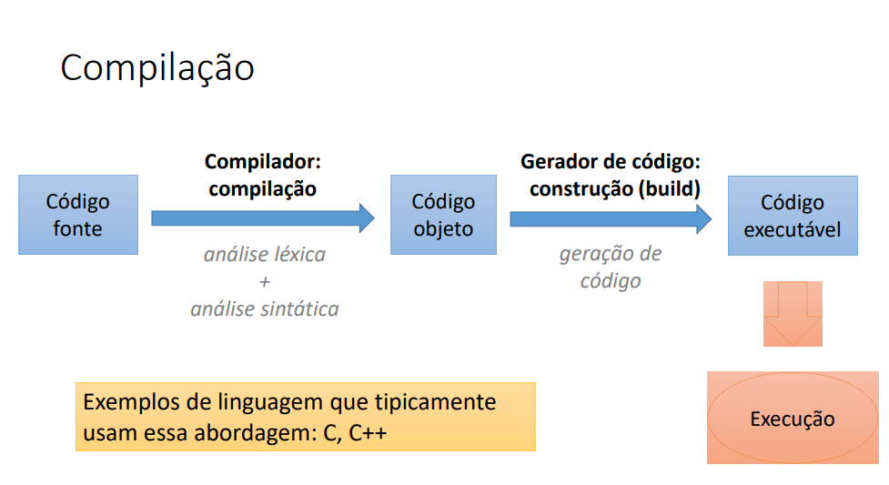
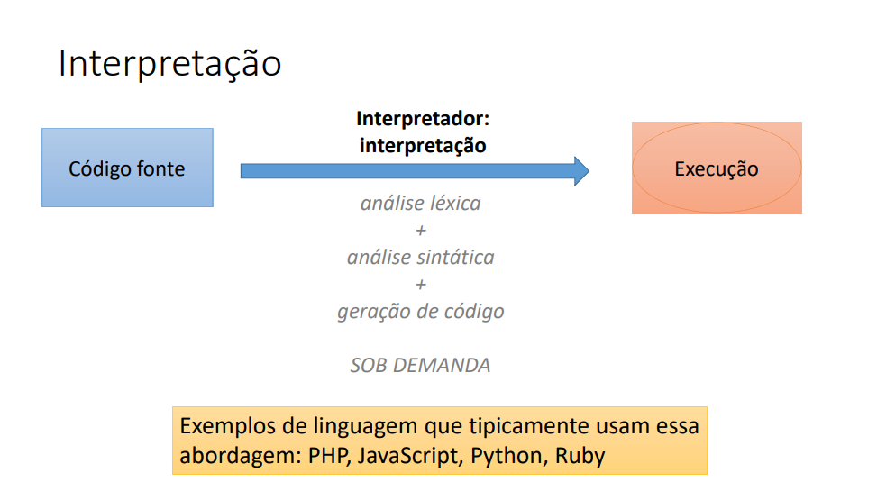
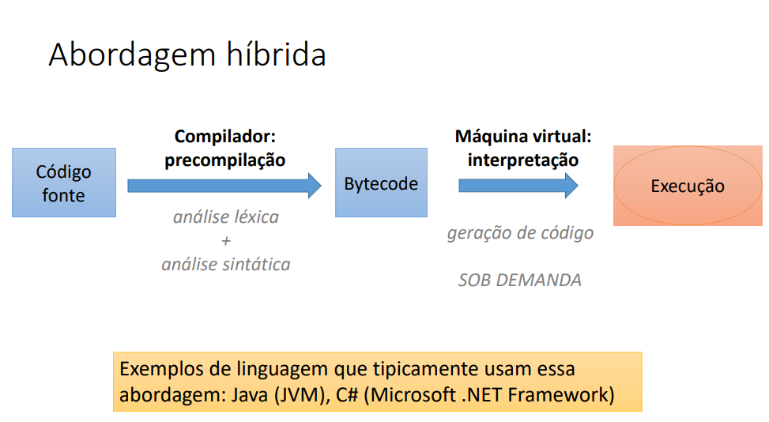
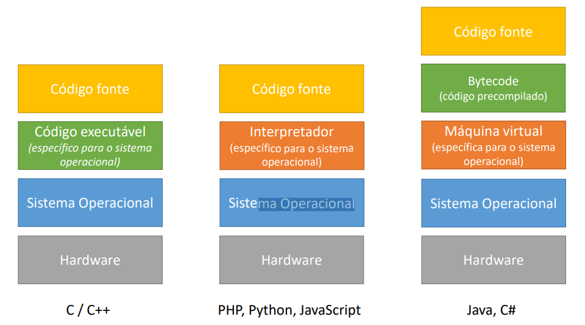
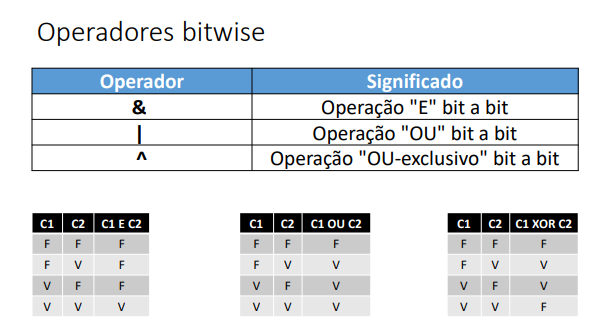
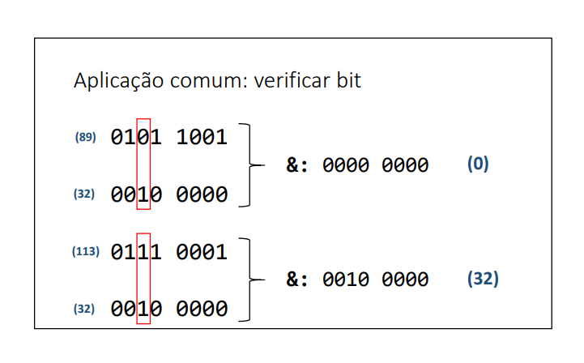

# JavaProject

## Algoritmo

Sequência finita de instruções para se resolver um problema.

## Automação

Consiste em utilizar máquina(s) para executar o procedimento desejado de forma automática ou semiautomática.

## O que é  preciso para fazer um programa de computador?

- uma linguagem de programação
- uma IDE
- Um compilador( PAPEL DE TRANSFORMAR CODIGO FONTE EM CODIGO EXECUTAVEL)
- Gerador de codigo / maquina virtual

## Programa vs Algoritmo

Programas de computador são algoritmos executados pelo computador .
Conclusão: o computador é uma máquina que automatiza a execução de algoritmos. 

## Linguagem de programação,léxica, sintática

Uma linguagem de programação: regras léxicas ( tem a ver com ortografia - palavras isoladas) e 
sintáticas( correção da sentença como um todo - gramática) para se escrever o programa

Uma IDE: software para editar e testar o programa

Um compilador: software para transformar o código fonte em código objeto

Um gerador de código ou máquina virtual: software que permite que o programa seja executado

## Linguagem de programação

É um conjunto de regras léxicas (ortografia) e sintáticas (gramática) para se escrever programas.

- Léxica> Diz respeito à correção das palavras "isoladas" (ortografia).

- Sintática: Diz respeito à correção das sentenças (gramática).

## IDE – Ambiente Integrado de Desenvolvimento

É um conjunto de softwares utilizado para a construção de programas

Funcionalidades de uma IDE (Integrated development environment ):

• Edição de código fonte (endentação, autocompletar, destaque de palavras, etc.)
• Depuração e testes
• Construção do produto final (build)
• Sugestão de modelos (templates)
• Auxiliar em várias tarefas do seu projeto
• Etc.

## Código fonte

É aquele escrito pelo o programador em linguagem de programação

- compilação (esse modelo de compilação é adotado por algumas linguagens 
como C e C++)

software para transformar o código fonte em código objeto

- Interpretador

- Abordagem Híbrida

bytecode(código objeto pré compilado ) e ele passa pela máquina virtual
codigo fonte(Main.java)
código objeto/bytecode Main.class ( o código pré compilado a partir do meu código .java)
Para o arquivo Main.class ser executado para ser executado eu tenho que executar a partir da máquina virtual do java.
Dessa forma quando um desenvolvedor for entregar um produto desenvolvido em java ele tem que entregar não só os arquivos
pré compilados como também a máquina virtual do java para que o programa possa ser executado.

## Vantagens da compilação vs Interpretação

Abordagem híbrida

- Compilação: 
• velocidade do programa
• auxílio do compilador antes da execução ( por que o compilador faz a análise léxixa e sintática do programa, se tiver um problema 
ele irá informar) (MUITO APROVEITADO NAS LINGUAGENS HÍBRIDAS)

- Interpretação:
  • flexibilidade de manutenção do aplicativo em produção
  • expressividade da linguagem ( é quando vc consegue escrever uma solução complexa em poucas linhas)
  • código fonte não precisa ser recompilado para rodar em plataformas diferentes(MUITO APROVEITADO NAS LINGUAGENS HÍBRIDAS)

C/C++: No caso das linguagens compiladas ( se eu quiser rodar o meu programa em outro sistema operacional, eu tenho que 
recompilar e gerar outro executável especifico para aquele sistema operacional)

PHP,Python, JavaScript: No caso de linguagens Interpretadas( se eu quiser rodar o meu programa em outro sistema operacional
eu tenho que trocar apenas o interpretador para o SO específico)

JAVA, C#: No caso das linguagens híbridas ( se você quiser que o seu bytecode rode em outro SO, basta trocar a JVM )

LEMBRANDO QUE : 

Código fonte: é o que o programador escreve
Código objeto/bytecode: é o código que já é compilado, é feito análise léxica e sintática e gerado o código objeto.

## Conhecendo Java

Versões do java: Java SE standard edition( versão padrão)

                 LTS Long-term support (Suporte de longo prazo)
https://www.oracle.com/java/technologies/java-se-support-roadmap.html

## O que é java?

é uma linguagem de programação (regras sintáticas) e também uma plataforma de desenvolvimento e execução o qual contém
Bibliotecas(API) e ambientes de execução ( para poder executar eu tenho que intalar a JRE e desenvolver eu instalo o jdk).

Aspectos Notáveis:
- codigo compilado para bytecode e executado em JVM
- Portável segura e robusta
- Roda em vários tipos de dispositivos
- Domina o mercado corportivo desde o fim do século 20
- Padrão android por muitos anos

## Edições do Java

- Java ME : Jva Micro Edition - dispositivos embarcados e móveis - IOT
- Java SE: Java Standard Edition  - core - desktop e servidores
- Java EE: Java Enterprise edition - aplicações Corporativas( conjunto de especificações )

## Plataforma Java SE

- JVM: java virtual machine
Maquina Virtual do Java : necessário para executar sistemas Java.

## Estrutura de uma aplicação Java

Java é uma linguagem orientada a Objetos. 
E a unidade lógica básica de um programa Orientado a Objetos é a classe.

Todo código em java , tem que estar dentro de classes.

Depois da classe nós temos o conceito de pacote= package( que é o agrupamento LÓGICO de classes relacionadas).

Depois do pacote nós temos o módulo que foi introduzido no Java +9.
Módulo é o agrupamento lógico de pacotes relacionados .
Os agrupamentos lógicos(isso significa que o agrupamento ele está no nível conceitual e um nível de código.) 
podem ser compilados e gerado o build ou o runtime que seria o agrupamento físico, que estaria sendo representado por arquivos.
Ou seja cada Build ou runtime é uma unidade física que pode ser instalada para rodar nos dispositivos

agrupamento lógico: isso significa que o agrupamento ele está no nível conceitual e um nível de código.
Runtime/build: é o agrupamento físico(é uma unidade física que pode ser instalada para rodar nos dispositivos);
build: Construção do produto final 

## Operadores bitiwise

Não confundir operação & bit a bit com operador lógico && .

